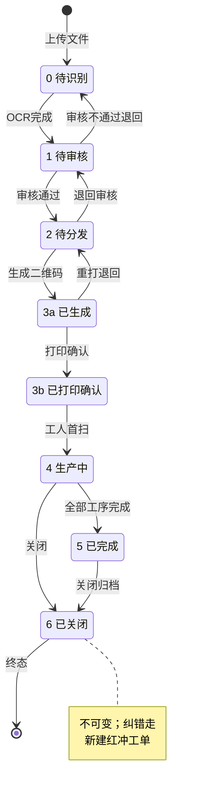
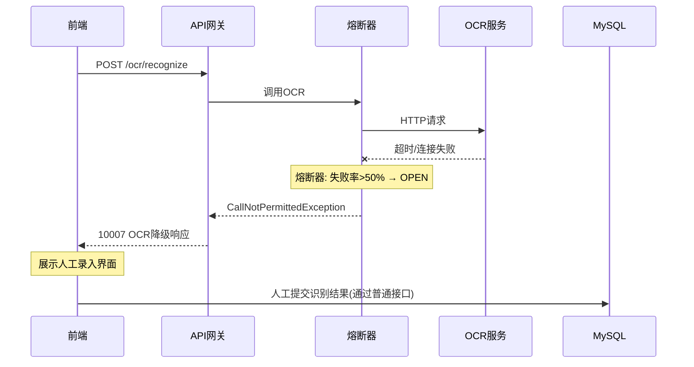
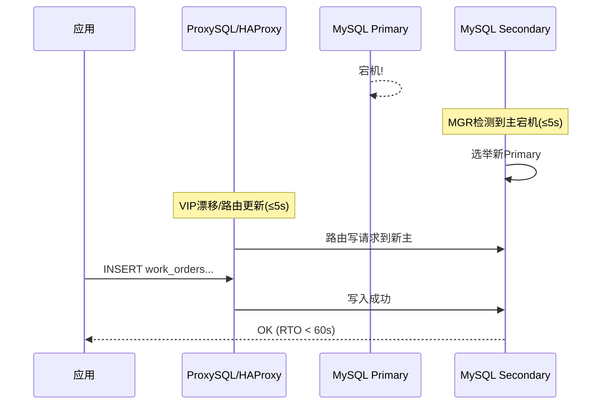
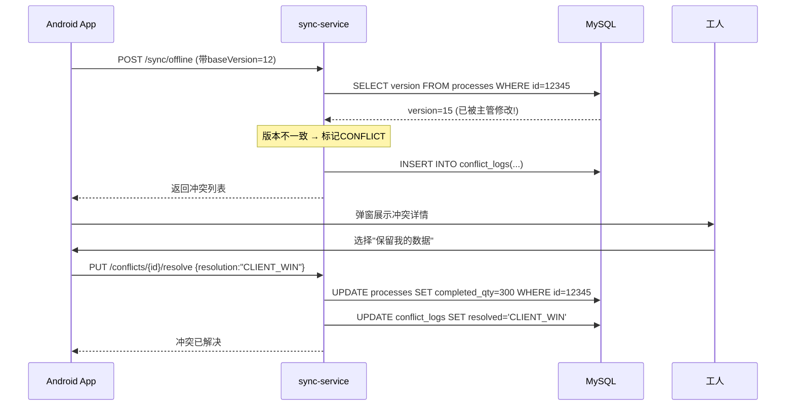

# 工单智能识别与扫码分发系统 - 需求与架构文档

**版本**: V5.0
**日期**: 2026-07-23
**状态**: 实现规格（基于 V4.2 设计稿，从"设计"推进到"可落地契约"）
**变更说明**: V4.2 → V5.0 新增实现规格三章：§25 接口契约(OpenAPI风格，含请求/响应/错误码/幂等键/状态机校验)、§26 数据模型与表结构(核心表字段+索引+状态枚举+乐观锁)、§27 前端组件拆分与模块边界(文员Web/工人App/主管App/大屏四端组件树)。设计稿(V4.2)中的产品决策全部转化为编码约束。


## 目录

1. [文档信息](#1-文档信息)
2. [项目概述](#2-项目概述)
3. [用户故事与场景](#3-用户故事与场景)
4. [功能需求](#4-功能需求)
5. [非功能需求](#5-非功能需求)
6. [业务规则汇总](#6-业务规则汇总)
7. [数据字典](#7-数据字典)
8. [验收标准](#8-验收标准)
9. [总体架构](#9-总体架构)
10. [模块设计](#10-模块设计)
11. [接口设计](#11-接口设计)
12. [网络部署架构](#12-网络部署架构)
13. [安全设计](#13-安全设计) ⭐ **V3.0 重写**
14. [性能与监控](#14-性能与监控) ⭐ **V3.0 重写**
15. [部署拓扑与硬件建议](#15-部署拓扑与硬件建议) ⭐ **V3.0 修正**
16. [接口文档清单](#16-接口文档清单)
17. [上线计划](#17-上线计划)
18. [高可用与容灾设计](#18-高可用与容灾设计) 🆕 **V3.0 新增**
19. [数据一致性设计](#19-数据一致性设计) 🆕 **V3.0 新增**
20. [运维规范](#20-运维规范) 🆕 **V3.0 新增**
21. [异常场景设计](#21-异常场景设计) 🆕 **V3.0 新增**
22. [压测标准与验收](#22-压测标准与验收) 🆕 **V3.0 新增**
23. [评审记录](#23-评审记录) 🆕 **V3.0 新增**
24. [架构师审查备忘录](#24-架构师审查备忘录-v3--v4-深化审查) 🆕 V4.0 新增
25. [接口契约（实现规格）](#25-接口契约实现规格) 🆕 V5.0 新增
26. [数据模型与表结构（实现规格）](#26-数据模型与表结构实现规格) 🆕 V5.0 新增
27. [前端组件拆分与模块边界（实现规格）](#27-前端组件拆分与模块边界实现规格) 🆕 V5.0 新增
28. [Phase 1 开发任务拆解（实现规格落地）](#28-phase-1-开发任务拆解实现规格落地) 🆕 V5.0 增补


## 1. 文档信息

| 项目 | 内容 |
|------|------|
| **文档名称** | 工单智能识别与扫码分发系统 需求与架构文档 |
| **版本** | V5.0 |
| **日期** | 2026-07-23 |
| **状态** | 已通过SRE评审（待开发） |
| **关联文档** | 异常场景设计手册、容灾切换手册、压测报告（待补充） |


## 2. 项目概述

### 2.1 项目背景

目前工厂的工单管理仍以纸质流程卡为主，存在以下问题：
- 工单信息需人工录入系统，效率低且易出错
- 纸质工单流转慢，工人需到公告栏查看
- 工序进度无法实时追踪，管理者缺乏数据支撑
- 工单归档后查询困难

### 2.2 项目目标

| 目标 | 指标 | 阶段 |
|------|------|------|
| 实现工单自动识别入库 | OCR识别准确率 ≥ **90%**(Phase1，支持3种主流格式+人工审核兜底) / ≥ **95%**(Phase2，引入标注平台+主动学习) | Phase 1→2 |
| 实现一单一码扫码查看 | 扫码到展示详情 < 3秒 | Phase 1 |
| 实现工序报工数字化 | 报工数据实时同步，支持离线 | Phase 2 |
| 实现车间大屏实时联动 | 数据延迟 < 5秒 | Phase 2 |
| 实现离线操作能力 | 断网时可本地缓存，支持冲突合并 | Phase 2 |

> **V3.0 变更**：OCR准确率从90%提升至95%，增加离线冲突合并要求。

### 2.3 项目范围

**包含范围：**
- PDF/图片工单的OCR识别与结构化入库
- 工单数据管理（增删改查、状态流转）
- 二维码/条形码生成与分发
- 微信小程序扫码查看工单详情
- 原生Android App（含工序报工、离线缓存）⭐ **V3.0 确定技术栈: Kotlin**
- 管理后台（工单管理、数据统计）
- 车间大屏实时看板

**不包含范围：**
- 与SAP/ERP系统的直接数据对接（预留接口，后期扩展）
- 排产/生产计划自动编排
- 设备数据自动采集（IoT）

### 2.4 目标用户画像

| 用户角色 | 使用场景 | 使用频率 | 终端 |
|---------|---------|---------|------|
| **文员/数据录入员** | 接收纸质/电子工单，上传系统 | 每日 | PC后台 |
| **车间主管/工艺员** | 审核工单、分配任务、查看进度 | 每日 | PC后台 + 大屏 |
| **一线工人** | 扫码查看工单、上报完成数量 | 每班次 | 小程序 + App |
| **质检员** | 录入检验数据、签名确认 | 每班次 | App |
| **管理者** | 查看产量统计、进度报表 | 每周 | PC后台 |


## 3. 用户故事与场景

### 3.1 核心用户故事

**故事一：文员上传工单**

> "作为文员，我每天收到大量纸质工单，我需要把它们一个个录入Excel，非常耗时。我希望能把工单拍照或扫描后直接上传，系统自动识别出工单号、产品、数量、工序等信息。"

**故事二：主管看进度**

> "作为车间主管，我想知道每个工单的工序做到哪了，哪些工位在忙、哪些闲着。我希望能有一个大屏幕实时显示所有工单的进度状态。"

**故事三：工人扫码看工单**

> "作为一线工人，我每天开工前要去公告栏看自己的工单，有时候看不清、有时候被拿走了。我希望能用手机扫一下工单上的码，所有信息都在手机上，还能直接报工。"

**故事四：质检员确认**

> "作为质检员，工序完成后我需要检验并签字，以前要在纸上签，容易丢。我希望能在手机上看到待检验的工序，直接录入合格/不良数量。"

**🆕 故事五：离线报工后冲突解决（V3.0新增）**

> "作为一线工人，我在没有网络的工位上完成了报工，回到有网络的地方后系统提示我的数据和主管刚修改的数据有冲突，我希望系统能清楚地告诉我哪里冲突了，让我选择保留哪份数据。"

### 3.2 业务流程图
```
[上游] → [本系统] → [下游]
│ │ │
▼ ▼ ▼
纸质工单 OCR识别 二维码生成
电子PDF 工单入库 分发打印
PDF文件 管理后台 微信扫码
图片文件 数据统计 App报工
车间大屏
```

### 3.3 异常流程图（V3.0新增）
```
正常流程: 上传 → OCR → 审核 → 分配 → 生产 → 完成
                                    ↓
异常分支:
├─ OCR超时/失败 → [熔断] → 降级为人工录入入口
├─ OCR低置信度(<70%) → [强制人工审核] → 修正后入库
├─ 网络中断 → [离线缓存] → 恢复后[冲突检测] → 合并/拒绝
├─ 批量操作中途失败 → [Saga补偿] → 回滚已成功项 / 标记失败项供重试
└─ 数据库主节点故障 → [HA自动切换] → RTO<60s, RPO<0
```


## 4. 功能需求

### 4.1 功能模块总览

| 模块 | 优先级 | 说明 |
|------|--------|------|
| M1 - 工单智能识别 | P0 | PDF/图片OCR识别与结构化提取 |
| M2 - 工单数据管理 | P0 | 增删改查、状态流转、审核修正 |
| M3 - 二维码/条形码生成 | P0 | 一单一码生成与分发 |
| M4 - 微信小程序 | P0 | 扫码查看工单详情 |
| M5 - 原生Android App (Kotlin) | P1 | 扫码查看、工序报工、离线缓存 |
| M6 - 管理后台 | P0 | PC端完整管理功能 |
| M7 - 车间大屏 | P1 | 实时进度看板 |
| M8 - 系统管理 | P1 | 用户权限、操作日志、配置管理 |
| M9 - 数据统计与报表 | P2 | 产量统计、进度分析 |

> **V3.0 变更**：M5 明确为 Kotlin 原生开发。

### 4.2 M1 - 工单智能识别

| 功能点ID | 功能描述 | 验收标准 |
|---------|---------|---------|
| M1-01 | 支持PDF、JPG、PNG、TIFF格式文件上传 | 4种格式均能正常上传 |
| M1-02 | 自动调用OCR引擎识别文字内容 | 识别响应时间 < 5秒/页 |
| M1-03 | 从识别结果中提取结构化字段：工单号、客户料号、产品编码、预计产量、PO号、客户、交货日期、批次数量、下单日期、计划日期 | 关键字段准确率 ≥ **90%**(Phase1) / ≥ **95%**(Phase2)；🆕新增工单模板需评估泛化工作量（≤5种格式=规则配置，>10种=算法训练） |
| M1-04 | 提取物料明细：序号、品号、规格、单位、仓库、预计日期 | 物料明细准确率 ≥ **90%** |
| M1-05 | 提取工序明细：序号、工序条码、工序名称、加工规格、要求完成数量、开工时间、作业员、机台 | 工序明细准确率 ≥ **90%** |
| M1-06 | 识别结果预览界面，高亮显示各字段 | 界面清晰展示所有提取字段 |
| M1-07 | 人工修正识别结果 | 修正后数据正确入库 |
| M1-08 | 批量上传与识别（最多20个文件/批） | 批量处理不超时，支持断点续传 |
| M1-09 | 识别失败时给出明确错误提示 | 提示"识别失败，请检查图片清晰度"等 |
| 🆕M1-10 | OCR服务熔断降级 | OCR不可用时返回原始图片+人工录入入口 |
| 🆕M1-11 | OCR置信度分级处理 | ≥95%自动通过；70%-95%需审核；<70%强制人工重录 |

**业务规则：**
- 同一工单号不允许重复上传（系统校验）
- 🆕 OCR识别置信度分级：≥95%自动通过，70%-95%需人工审核，<70%重新识别或强制人工录入
- 支持工单模板配置（不同格式工单可配置不同提取规则）
- 🆕 建立OCR纠错库：常见错误映射（如 `l`→`1`, `O`→`0`, `I`→`l`），持续优化

### 4.3 M2 - 工单数据管理

| 功能点ID | 功能描述 | 验收标准 |
|---------|---------|---------|
| M2-01 | 工单列表展示（表格形式） | 展示工单号、产品、数量、状态、日期等 |
| M2-02 | 多条件筛选（工单号、日期范围、状态、客户） | 筛选结果正确 |
| M2-03 | 工单详情查看（完整信息） | 展示所有字段及明细 |
| M2-04 | 工单状态流转管理 | 支持状态变更并记录日志 |
| M2-05 | 工单信息编辑修改 | 修改后数据更新 |
| M2-06 | 工单删除（软删除） | 删除后列表不显示，可恢复 |
| M2-07 | 工单导出Excel | 导出字段完整 |

**状态定义：**

| 状态码 | 状态名称 | 说明 |
|--------|---------|------|
| 0 | 待识别 | 已上传待OCR识别 |
| 1 | 待审核 | OCR完成待人工确认 |
| 2 | 待分发 | 审核通过待生成二维码 |
| 3 | 已分发 | 二维码已生成待打印 |
| 4 | 生产中 | 工序已开始报工 |
| 5 | 已完成 | 所有工序完成 |
| 6 | 已关闭 | 工单关闭归档 |

> 🆕 **前后端状态机协同（对应 §24.5 建议4）**：后端提供 `GET /api/v1/work-orders/{id}/state-machine` 返回 `currentState` / `allowedTransitions` / `visibleButtons`；前端按钮可见性**完全由该接口驱动**，禁止硬编码；状态变更使用乐观锁(version)+CAS 操作。
> 🆕 **合法跳转边**见 §4.9 状态转移矩阵（V4.2 新增），是 `state-machine` 接口与 `PATCH /status` 校验的**权威数据源**，非法跳转返回 409（落实评审 D3）。

### 4.4 M3 - 二维码/条形码生成

| 功能点ID | 功能描述 | 验收标准 |
|---------|---------|---------|
| M3-01 | 单个工单生成二维码 | 生成含小程序/App跳转参数 |
| M3-02 | 批量生成二维码（最多100个） | 导出PDF供打印，**支持失败重试和进度追踪**；🆕单张打印失败可单独重打（状态 3 细分为 3a/3b，见 BR-21） |
| M3-03 | 条形码生成（Code128） | 符合条形码标准 |
| M3-04 | 二维码下载（PNG/SVG格式） | 下载成功 |
| M3-05 | 二维码直接打印 | 打印清晰可扫 |
| M3-06 | 二维码包含信息：工单号 + 跳转链接 + 有效期 + 签名 | 扫码后正确跳转且防篡改 |
| 🆕M3-07 | 过期二维码处理 | 返回"已失效"友好页面，非404 |
| 🆕M3-08 | 二维码访问鉴权 | 扫码后校验登录态/权限 |

**二维码编码格式：**

| 编码方式 | 格式示例 | 用途 |
|---------|---------|------|
| 微信小程序码 | `pages/detail/detail?token=xxx&sign=yyy` | 小程序扫码跳转（🆕使用随机token替代明文工单号） |
| App通用码 | `https://api.xxx.com/qr/{randomToken}` | App扫码解析（🆕防枚举） |
| 纯数据码 | `WOD-1901050003-1-7` | 简单扫码显示 |

### 4.5 M4 - 微信小程序

| 功能点ID | 功能描述 | 验收标准 |
|---------|---------|---------|
| M4-01 | 扫码功能（调用微信相机） | 扫码响应 < 2秒 |
| M4-02 | 工单详情展示 | 完整展示工单信息 |
| M4-03 | 工序进度展示 | 可视化展示各工序状态 |
| M4-04 | 扫码历史记录 | 展示扫码过的工单列表 |
| M4-05 | 工单状态查看 | 显示当前工单状态 |
| M4-06 | 报工（轻量级） | 可选（推荐App完成） |

### 4.6 M5 - 原生Android App（Kotlin）

> **V3.0 决策**：采用 Kotlin 原生开发（非Flutter），理由：
> - SQLite 离线能力强，Room ORM 成熟
> - 原生扫描头硬件集成稳定（USB-HID/串口）
> - 后台保活机制可控（Foreground Service）
> - 团队 Android 技术栈熟悉度高

| 功能点ID | 功能描述 | 验收标准 |
|---------|---------|---------|
| M5-01 | 扫码功能（相机 + 扫描头） | 支持主流扫描头（新大陆、优博讯） |
| M5-02 | 工单详情展示 | 完整展示，含工序明细 |
| M5-03 | 工序报工（**幂等设计**） | 选择工序 → 填写完成数量 → 提交，重复提交不翻倍 |
| M5-04 | 离线缓存（SQLite/Room） | 断网时可查看已缓存工单 |
| M5-05 | 离线报工队列（**含版本控制**） | 断网时缓存报工记录+基线版本，恢复后自动上传并检测冲突 |
| M5-06 | 网络自动切换（内网/外网） | WiFi下优先内网，外网自动切换 |
| M5-07 | 消息推送 | 新工单分配、紧急通知（FCM / MQTT） |
| M5-08 | 大屏联动 | 报工后大屏实时刷新 |
| M5-09 | 质检员功能 | 检验录入、签名确认 |
| M5-10 | 操作日志 | 记录所有操作 |
| 🆕M5-11 | 冲突解决UI（V4.2 修订） | 离线冲突时弹窗仅提示"数据已保存，与主管修改有出入，已提交主管确认"；**不作二选一裁决**（裁决在 M6-12 由主管处理），不暴露版本号 |
| 🆕M5-12 | 报工撤回与审核 | 提交后 N 分钟内本人可撤回（§4.9.2）；关键工序报工进入"待确认"子态待主管确认 |
| 🆕M5-13 | 在线并发自动合并 | 同工序多端同时报工时服务端累加合并，工人端无感知（BR-22） |

**App技术规范：**
- 最低Android版本：Android 7.0 (API 24)
- 目标Android版本：Android 14 (API 34)
- 包体积：< 50MB
- 离线数据库：Room (SQLite封装)
- 网络库：Retrofit2 + OkHttp3
- 图片加载：Glide
- 架构：MVVM + Repository Pattern

### 4.7 M6 - 管理后台

| 功能点ID | 功能描述 | 验收标准 |
|---------|---------|---------|
| M6-01 | 登录/权限管理（**含数据权限**） | RBAC + 行级数据隔离 |
| M6-02 | 工单列表 | 分页展示、筛选、排序 |
| M6-03 | 工单上传与识别 | 上传 → OCR → 预览 → 入库 |
| M6-04 | 工单审核 | 确认/修正识别结果 |
| M6-05 | 二维码生成与下载 | 单个/批量生成（含进度条） |
| M6-06 | 工序管理 | 工序字典维护 |
| M6-07 | 人员管理 | 作业员、检验员维护 |
| M6-08 | 设备管理 | 机台设备维护 |
| M6-09 | 数据统计 | 产量统计、进度报表 |
| M6-10 | 操作日志 | 审计日志查询 |
| M6-11 | 系统配置 | 工单模板配置、OCR引擎切换 |
| 🆕M6-12 | 冲突记录管理 | 查看/处理离线同步冲突记录 |

### 4.8 M7 - 车间大屏

| 功能点ID | 功能描述 | 验收标准 |
|---------|---------|---------|
| M7-01 | 实时工单状态总览 | SSE推送，延迟 < 5秒 |
| M7-02 | 工序进度可视化 | 进度条/甘特图 |
| M7-03 | 异常工单报警 | 超期工单红色闪烁 |
| M7-04 | 产量日报 | 当日/当班产量统计 |
| M7-05 | 全屏模式 | 自动轮播/全屏展示 |
| 🆕M7-06 | 断线重连 | WebSocket/SSE断开后自动重连+全量补齐 |


### 4.9 🆕 状态机与报工控制增强（V4.2 评审落实）

> 本节落实 PRD 场景化评审报告(V1) 的 D2/D3/D4/D7 四项缺陷。

#### 4.9.1 状态转移矩阵（权威定义）

`PATCH /work-orders/{id}/status` 除校验乐观锁(version)外，**必须校验目标态是否在当前态的 `allowedTransitions` 内**，非法跳转直接返回 `409 Conflict`。显式转移边如下：

| 当前态 | 允许跳转至 | 说明 |
|--------|-----------|------|
| 0 待识别 | 1 待审核 | OCR 完成 |
| 1 待审核 | 0 待识别 / 2 待分发 | 审核不通过可退回识别；通过进待分发 |
| 2 待分发 | 1 待审核 / 3a 已生成 | 退回审核；生成二维码 |
| 3a 已生成 | 3b 已打印确认 / 2 待分发 | 打印确认；重打退回 |
| 3b 已打印确认 | 4 生产中 | 工人首扫后 |
| 4 生产中 | 5 已完成 / 6 已关闭 | **禁止回退**至 2/3 |
| 5 已完成 | 6 已关闭 | **禁止回退** |
| 6 已关闭 | （终态，不可变） | 纠错走新建红冲工单，不回退原单 |

> `state-machine` 接口返回的 `allowedTransitions` 以此表为唯一数据源，前端按钮严格由接口驱动（§4.3）。

**状态转移图（Mermaid）：**



> ⚠ **防线**：任何未在图中的边（如 `5已完成 → 2待分发`、`6已关闭 → 4生产中`）均被 `PATCH /status` 的 `allowedTransitions` 校验拦截并返回 409，杜绝非法回退（落实 D3）。

#### 4.9.2 报工撤回与审核（落实 D2）

- **撤回窗口**：报工提交后 N 分钟内（可配置，默认 30min）本人可撤回；或状态未进入下一工序前可撤回（BR-04 记录撤回日志）。
- **班组长审核节点**：关键工序（可在工序字典配置 `need_review`）报工后进入 `待确认` 子态，主管确认后方计入产量。
- **异常数量二次确认**：本次报工数量同比该工人历史均值偏差 >X%（可配置）时，弹窗"您填写 {x}，历史均值 {y}，确认提交？"，防呆优先于事后纠错。

#### 4.9.3 在线并发与离线冲突的角色分离（落实 D4/D7）

- **在线并发**（见 BR-22）：服务端自动合并，工人无感知，不弹"选保留方"。
- **离线冲突**（见 BR-06）：默认本地优先 + 待主管复核，工人端不裁决。
- **裁决权限矩阵**：工人 = 无裁决权；主管/文员 = 可裁决（M6-12 冲突记录管理）。

#### 4.9.4 🆕 关键交互原型描述（落实 D2/D4/D5/D7）

**场景 A：工人报工撤回（D2）**
1. 工人在 App 工序页提交"完成数量=100"，成功记录 `report_id` + `created_at`，状态进入"已报工（未进下工序）"。
2. 30min 内 / 下工序未开始前，按钮区显示"撤回"；点击调 `DELETE /reports/{id}`（或 `PATCH` 置无效），BR-04 记撤回日志。
3. 超过窗口按钮置灰，需主管在 M6 后台"更正单"处理。

**场景 B：同工序两工人同时报工（D4）**
1. A、B 同日同工序，A 报 60、B 报 40，几乎同时提交（均带基线 version）。
2. 服务端按 `order_process` **累加**：`completed_qty = 60+40=100`，version 自增，返回"已合并"。
3. 工人端仅见"报工成功，已与同事数据合并"，**不弹二选一**（BR-22）。
4. 仅当 `100 > 要求量` 时升级主管，主管在 M6-12 裁决。

**场景 C：大屏断网降级（D5）**
1. 正常：大屏每 5s 收 SSE 推送，右上角"数据更新于 14:23:05"。
2. SSE 心跳中断 >30s：整屏叠加灰色蒙层 + 顶部红字横幅"⚠ 连接中断，数据非实时"（BR-19）。
3. 中断 >5min：切"静态快照模式"，角标变"最后更新 14:20:00（离线快照）"。
4. 恢复连接：自动重连 + 全量补齐，蒙层消失，时间戳复位。

**场景 D：工人离线报工后冲突（D7）**
1. 工人离线报工 50 件（基线 version=10），恢复网络自动上传。
2. 服务端发现 version 已变（主管改为 45），标记 CONFLICT，写 `conflict_logs`，默认"本地优先 + 待复核"（BR-06）。
3. 工人端弹窗："您的数据已保存，与主管修改有出入，已提交主管确认"，**无二选一**。
4. 主管在 M6-12 看到冲突记录，选保留方 / 手动合并，结果回写工人端。

#### 4.9.5 🆕 App 端页面级线框与文案规范（落实 D2/D4/D7）

**4.9.5.1 工序报工页（M5-03 / 撤回 D2）**

```
┌─────────────────────────────┐
│ ← 工序报工          工单 WOD-… │
├─────────────────────────────┤
│ 工序：CNC 粗加工 (第 2/5 道)  │
│ 要求数量：100   已报：0       │
│                             │
│ 本次完成数量 [ 100        ▦ ] │ ← 数字键盘输入
│                             │
│ [ 提交报工 ]                 │ ← 主按钮(底栏固定)
│                             │
│ 提交成功卡片：               │
│ ┌───────────────────────┐   │
│ │ ✓ 报工成功            │   │
│ │ 已完成 100/100        │   │
│ │ [ 撤回 ] (00:30:00 内)│   │ ← 次级按钮+倒计时
│ └───────────────────────┘   │
└─────────────────────────────┘
```
- **撤回按钮位置**：提交成功卡片内、主按钮上方；带 `mm:ss` 倒计时，归零置灰（D2）。
- **文案规范**：成功提示="报工成功，已完成 X/Y"；撤回二次确认="确认撤回本次报工？撤回后需重新报工"（防误触）。

**4.9.5.2 异常数量二次确认弹窗（D2 防呆）**

```
┌─────────────────────────────┐
│ ⚠ 数量异常确认               │
│ ─────────────────────────── │
│ 您填写 120，该工序历史均值 100│
│ 偏差 20%，确认提交？         │
│                             │
│ [ 取消 ]        [ 仍然提交 ] │
└─────────────────────────────┘
```
- **触发条件**：`|本次-均值|/均值 > 阈值X%`（默认 30%，可由工序字典配置）。
- **文案固定**，禁止出现版本号 / 技术术语（如"version""CAS"）。

**4.9.5.3 同工序并发合并反馈（D4）**

```
正常合并 Toast（2s 自动消失）：
  "✓ 报工成功，已与同事数据合并（累计 100/100）"

累计超要求量时改为警示：
  "⚠ 累计 120 已超要求 100，已上报主管确认"
```
- 工人端**不弹任何选择框**；裁决留待主管在 M6-12 处理（BR-22）。

**4.9.5.4 离线冲突反馈弹窗（D7）**

```
┌─────────────────────────────┐
│ ℹ 数据已保存                 │
│ ─────────────────────────── │
│ 您的报工已保存，与主管最新修改│
│ 有出入，已提交主管确认。      │
│ 无需您处理。                 │
│                             │
│ [ 我知道了 ]                 │
└─────────────────────────────┘
```
- **严禁**出现"选择保留哪份""版本冲突"等字眼；不暴露 `version`（BR-06）。

**4.9.5.5 大屏断网降级视觉规范（D5）**

```
正常态：   右上角 [🟢 数据更新于 14:23:05]
>30s 无推送：整屏 30% 灰蒙层 + 顶部红字横幅
            "⚠ 连接中断，当前数据非实时"
>5min：    角标变 [🟡 最后更新 14:20:00（离线快照）]
恢复连接：  蒙层消失，角标回到 🟢 实时
```
- 横幅常驻直至恢复；警示红 `#F5222D`，不遮挡关键 KPI 数字（BR-19）。

## 5. 非功能需求

| 类别 | 需求 | 指标 |
|------|------|------|
| **性能** | 单页PDF识别时间 | < 5秒 |
| | 工单详情API响应 (P50) | < 200ms |
| | 工单详情API响应 (P95) | < 500ms |
| | 工单详情API响应 (P99) | < 1000ms |
| | 扫码到展示详情 | < 3秒 |
| | 大屏数据刷新延迟 | < 5秒 |
| | 🆕 大屏断网降级展示 | 断网>30s 显示非实时横幅，>5min 切静态快照模式（BR-19） |
| **并发** | 同时在线用户 | ≥ 100 |
| | 同时扫码并发 | ≥ 50 |
| | API峰值QPS | ≥ 200（含缓冲） |
| **可用性** | 系统可用率（SLA） | ≥ **99.9%**（年度停机 < 8.76小时） |
| | 故障恢复时间RTO | < **5分钟**（自动切换）/ <30分钟（人工介入） |
| | 数据丢失容忍RPO | < **1小时**（MySQL binlog）/ **近实时**（主从同步） |
| | OCR服务可用率 | ≥ 99%（允许短暂降级） |
| **安全** | 数据传输 | HTTPS (TLS 1.3)，内网可选TLS 1.2 |
| | 敏感字段加密 | AES-256-GCM 加密存储（客户信息、价格、PO号） |
| | 文件加密 | MinIO SSE-S3 服务端加密 或 应用层AES |
| | 操作审计 | 全部操作可追溯，日志保留180天 |
| | 接口鉴权 | JWT + RBAC + 数据行级权限 |
| **兼容性** | 浏览器 | Chrome/Edge最新2个版本 |
| | 微信版本 | 最新3个版本 |
| | Android | 7.0及以上 |
| **扩展性** | API | RESTful标准，支持第三方集成 |
| | 数据导出 | Excel/CSV格式 |
| **🆕 容灾** | OCR熔断 | 超时8s自动熔断，10s后半开探测 |
| | 缓存穿透防护 | 布隆过滤器 + 空值缓存 |
| | 离线冲突 | 版本号乐观锁 + 冲突解决UI |


## 6. 业务规则汇总

| 规则编号 | 规则描述 |
|---------|---------|
| BR-01 | 工单号全局唯一，重复上传时系统提示"工单号已存在" |
| BR-02 | 🆕 OCR识别置信度分级：≥95%自动通过，70%-95%需人工审核，<70%强制人工重录或标记为"需手工录入" |
| BR-03 | 二维码有效期默认为工单交货日期+30天，过期后返回友好失效页面 |
| BR-04 | 工单状态变更需记录操作日志（谁、何时、从什么状态变为什么） |
| BR-05 | 工序报工时，完成数量 ≤ 要求完成数量 - 已报工数量（防超报） |
| BR-06 | 🆕 **报工冲突解决策略（V4.2 修订）**：分两类处理。①**在线并发**：同工序多端同时报工，服务端按业务规则**自动合并**（累加已完成数量，取 max(client_created_at)），仅当累加超要求量时升级主管；**不弹"选保留方"给工人**（见 BR-22）。②**离线冲突**：客户端携带基线 version 提交，版本一致直接合并；不一致标记 CONFLICT 写入 conflict_logs，**默认策略为"本地优先 + 标记待主管复核"**（非工人当场裁决）；裁决 UI 仅对主管/文员角色开放（见 BR-10）。③ 工人端冲突仅提示"数据已保存，与主管修改有出入，已提交主管确认"，不暴露版本号概念 |
| BR-07 | 大屏采用SSE单向推送（非轮询），每5秒心跳保活，断线后自动重连并全量同步 |
| BR-08 | 超期工单（当前日期 > 交货日期且状态未完成）在大屏上红色闪烁提示 |
| BR-09 | 管理员可配置工单模板（字段映射规则） |
| BR-10 | 用户权限分为：管理员(SUPER_ADMIN)、主管(MANAGER)、文员(CLERK)、工人(WORKER)、质检员(QC)；另加数据权限维度：ALL(全部数据)、DEPT(本部门)、SELF(仅自己) |
| 🆕BR-11 | **报工幂等性**：每次报工请求必须携带requestId（UUID），服务端Redis去重窗口5分钟，相同requestId直接返回首次结果 |
| 🆕BR-12 | **批量操作事务性**：批量生成二维码/批量识别采用Saga模式，每个子任务独立记录状态(PENDING/SUCCESS/FAILED)，失败项支持单独重试，前端展示进度条 |
| 🆕BR-13 | **缓存更新策略**：Cache-Aside模式——先更DB成功后再删缓存（而非更新缓存）；关键数据TTL=5min；写操作后主动失效相关缓存Key |
| 🆕BR-14 | **布隆过滤器**：工单号查询先过布隆过滤器，不存在直接返回避免穿透MySQL |
| 🆕BR-15 | **二维码打印分辨率规范**：①单码最小打印尺寸 20mm×20mm；②限制二维码Version≤10（41×41模块），内容过长则缩短token；③四周留白≥4模块(quiet zone)；④提供两种输出：单张PNG(300DPI贴纸打印机)、A4 PDF(600DPI激光打印机) |
| 🆕BR-16 | **多租户隔离**：所有表增加 tenant_id；MyBatis 拦截器自动注入 `WHERE tenant_id = ?`；唯一索引统一含 tenant_id（如 UNIQUE(tenant_id, order_no)）；预留升级至 Schema/实例隔离 |
| 🆕BR-17 | **OCR 异步化**：文件上传后 OCR 任务入消息队列，API 立即返回 taskId；OCR Worker 独立水平扩展（GPU）；完成通过 WebSocket/轮询推送，失败自动重试（死信队列） |
| 🆕BR-18 | **状态转移矩阵（权威）**：工单状态(0-6)合法跳转见 §4.9；终态(6 已关闭)不可变；"已完成/已关闭"禁止回退；关闭后纠错走新建红冲工单而非回退原单（落实 D3） |
| 🆕BR-19 | **大屏数据新鲜度**：大屏常驻显示"数据更新于 HH:MM:SS"；超过 30s 无推送整屏变灰并横幅"连接中断，数据非实时"；断网>5min 自动切静态快照模式并标注；该降级展示纳入 §5 验收（落实 D5） |
| 🆕BR-20 | **OCR 整单级处置（落实 D1）**：整单关键字段错≥3 或整单置信度<60% 时，直接进入"新建空白工单"快捷通道（跳过 OCR 预填）；修正界面支持字段级"采用原文/采用OCR/清空"三态一键切换；埋点 correction_seconds 反推是否优于手录 |
| 🆕BR-21 | **打印失败回退（落实 D6）**：状态 3 细分为 3a 已生成 / 3b 已打印确认；工人扫码"无工单"可一键申请重打（主管审批）；后台监控"已分发但未首扫>X 小时"预警贴漏 |
| 🆕BR-22 | **在线报工自动合并（落实 D4）**：同工序并发报工服务端累加，冲突裁决仅限主管/离线场景，工人端不暴露版本号与二选一 UI |


## 7. 数据字典

### 7.1 工单主表（work_orders）

| 字段名 | 类型 | 长度 | 必填 | 说明 |
|--------|------|------|------|------|
| id | BIGINT | — | ✅ | 主键自增 |
| order_no | VARCHAR | 50 | ✅ | 🆕系统内部主键（UUID v7 时间有序，全局唯一，替代业务编号）；🆕唯一索引改为 UNIQUE(tenant_id, order_no) |
| display_no | VARCHAR | 50 | ❌ | 🆕面向用户展示的工单号（如WOD-1901050003-1-7），允许重复，多工厂合并不冲突 |
| 🆕tenant_id | BIGINT | — | ✅ | 🆕多租户/多工厂隔离ID（数据隔离维度，所有查询自动注入 WHERE tenant_id=?） |
| customer_part_no | VARCHAR | 100 | ❌ | 客户料号（**AES加密存储**） |
| product_code | VARCHAR | 100 | ❌ | 产品编码 |
| expected_qty | INT | — | ❌ | 预计产量 |
| batch_qty | INT | — | ❌ | 批次数量 |
| po_no | VARCHAR | 50 | ❌ | PO号（**AES加密存储**） |
| customer | VARCHAR | 100 | ❌ | 客户名称（**AES加密存储**） |
| order_date | DATE | — | ❌ | 下单日期 |
| delivery_date | DATE | — | ❌ | 交货日期 |
| plan_date | DATE | — | ❌ | 计划日期 |
| status | TINYINT | — | ✅ | 状态码（0-6） |
| 🆕version | INT | — | ✅ | 乐观锁版本号（用于离线冲突检测） |
| source_file_url | VARCHAR | 500 | ❌ | 原始文件路径（MinIO） |
| ocr_raw_text | TEXT | — | ❌ | OCR原始识别文本 |
| ocr_confidence | DECIMAL | 5,2 | ❌ | OCR整体置信度 |
| 🆕dept_id | BIGINT | — | ❌ | 所属部门ID（数据权限隔离用） |
| created_by | BIGINT | — | ✅ | 创建人ID |
| created_at | DATETIME | — | ✅ | 创建时间 |
| updated_at | DATETIME | — | ✅ | 更新时间 |

### 7.2 工序明细表（work_processes）

| 字段名 | 类型 | 长度 | 必填 | 说明 |
|--------|------|------|------|------|
| id | BIGINT | — | ✅ | 主键自增 |
| order_id | BIGINT | — | ✅ | 关联工单ID（外键索引） |
| seq_no | VARCHAR | 10 | ✅ | 序号（如0010） |
| process_code | VARCHAR | 50 | ❌ | 工序条码 |
| process_name | VARCHAR | 100 | ✅ | 工序名称 |
| spec | VARCHAR | 200 | ❌ | 加工规格 |
| required_qty | INT | — | ✅ | 要求完成数量 |
| start_time | DATETIME | — | ❌ | 开工时间 |
| completed_qty | INT | — | ✅ | 完成数量（默认0） |
| completed_time | DATETIME | — | ❌ | 完成时间 |
| operator | VARCHAR | 50 | ❌ | 作业员 |
| machine_no | VARCHAR | 50 | ❌ | 机台 |
| qualified_qty | INT | — | ❌ | 合格数量 |
| defective_qty | INT | — | ❌ | 不良数量 |
| yield_rate | DECIMAL | 5,2 | ❌ | 良率 |
| inspector | VARCHAR | 50 | ❌ | 检验员签名 |
| process_status | TINYINT | — | ✅ | 0待开工/1进行中/2已完成 |
| sort_order | INT | — | ✅ | 工序排序 |
| 🆕version | INT | — | ✅ | 乐观锁版本号 |

### 7.3 🆕 离线报工队列表（offline_reports）

```sql
CREATE TABLE offline_reports (
    id BIGINT PRIMARY KEY AUTO_INCREMENT,
    report_id VARCHAR(64) NOT NULL UNIQUE COMMENT '唯一报工ID(UUID)',
    process_id BIGINT NOT NULL COMMENT '工序ID',
    order_id BIGINT NOT NULL COMMENT '工单ID',
    completed_qty INT NOT NULL COMMENT '完成数量',
    qualified_qty INT DEFAULT 0 COMMENT '合格数量',
    defective_qty INT DEFAULT 0 COMMENT '不良数量',
    operator VARCHAR(50) COMMENT '作业员',
    machine_no VARCHAR(50) COMMENT '机台',
    base_version INT NOT NULL COMMENT '报工时的服务端数据版本号',
    client_created_at DATETIME NOT NULL COMMENT '客户端创建时间',
    sync_status TINYINT DEFAULT 0 COMMENT '同步状态: 0待同步 1已同步 2冲突 3已解决',
    conflict_detail JSON COMMENT '冲突详情(JSON)',
    resolved_by BIGINT COMMENT '冲突解决人ID',
    resolved_at DATETIME COMMENT '冲突解决时间',
    device_id VARCHAR(64) COMMENT '设备标识',
    created_at DATETIME DEFAULT CURRENT_TIMESTAMP,
    INDEX idx_sync_status (sync_status),
    INDEX idx_order_id (order_id),
    INDEX idx_process_id (process_id)
) ENGINE=InnoDB DEFAULT CHARSET=utf8mb4 COMMENT='离线报工队列';
```

### 7.4 🆕 冲突记录表（conflict_logs）

```sql
CREATE TABLE conflict_logs (
    id BIGINT PRIMARY KEY AUTO_INCREMENT,
    offline_report_id BIGINT NOT NULL COMMENT '关联的离线报工ID',
    order_id BIGINT NOT NULL COMMENT '工单ID',
    process_id BIGINT NOT NULL COMMENT '工序ID',
    client_data JSON NOT NULL COMMENT '客户端数据快照',
    server_data JSON NOT NULL COMMENT '服务端数据快照',
    base_version INT NOT NULL COMMENT '客户端基线版本',
    current_version INT NOT NULL COMMENT '服务端当前版本',
    resolution ENUM('CLIENT_WIN','SERVER_WIN','MERGE','PENDING') DEFAULT 'PENDING' COMMENT '解决方式',
    resolved_by BIGINT COMMENT '解决人',
    resolved_at DATETIME COMMENT '解决时间',
    created_at DATETIME DEFAULT CURRENT_TIMESTAMP,
    INDEX idx_order_id (order_id),
    INDEX idx_resolution (resolution)
) ENGINE=InnoDB DEFAULT CHARSET=utf8mb4 COMMENT='离线同步冲突记录';
```

### 7.5 🆕 批量任务表（batch_tasks）

```sql
CREATE TABLE batch_tasks (
    id BIGINT PRIMARY KEY AUTO_INCREMENT,
    task_type ENUM('QR_GENERATE','OCR_RECOGNIZE','FILE_UPLOAD') NOT NULL,
    total_count INT NOT NULL COMMENT '总任务数',
    success_count INT DEFAULT 0 COMMENT '成功数',
    failed_count INT DEFAULT 0 COMMENT '失败数',
    status ENUM('PENDING','RUNNING','COMPLETED','PARTIAL_FAILED','ROLLBACK') DEFAULT 'PENDING',
    result_summary JSON COMMENT '各子项结果明细',
    created_by BIGINT NOT NULL,
    created_at DATETIME DEFAULT CURRENT_TIMESTAMP,
    updated_at DATETIME DEFAULT CURRENT_TIMESTAMP ON UPDATE CURRENT_TIMESTAMP,
    INDEX idx_status (status),
    INDEX idx_task_type (task_type)
) ENGINE=InnoDB DEFAULT CHARSET=utf8mb4 COMMENT='批量任务跟踪';
```

### 7.6 辅助表

**工序字典表（process_dict）：**

```sql
CREATE TABLE process_dict (
    id BIGINT PRIMARY KEY AUTO_INCREMENT,
    process_code VARCHAR(50) UNIQUE NOT NULL,
    process_name VARCHAR(100) NOT NULL,
    process_type VARCHAR(50),
    default_machine VARCHAR(50),
    sort_order INT DEFAULT 0,
    is_active BOOLEAN DEFAULT TRUE,
    created_at DATETIME
);
```

**🆕 幂等性记录表（idempotent_keys）：**

```sql
CREATE TABLE idempotent_keys (
    id BIGINT PRIMARY KEY AUTO_INCREMENT,
    request_key VARCHAR(128) NOT NULL UNIQUE COMMENT '幂等键(requestId)',
    api_path VARCHAR(256) NOT NULL COMMENT '接口路径',
    response_body JSON COMMENT '首次响应结果',
    created_at DATETIME DEFAULT CURRENT_TIMESTAMP,
    expire_at DATETIME NOT NULL COMMENT '过期时间',
    INDEX idx_expire (expire_at)
) ENGINE=InnoDB DEFAULT CHARSET=utf8mb4 COMMENT='幂等性去重';
-- 配合定时任务清理过期记录（每小时一次）
```


## 8. 验收标准

| 维度 | 标准 |
|------|------|
| 功能 | 所有P0功能测试用例100%通过，P1 ≥ 95% |
| OCR准确率 | 关键字段 ≥ **90%**(Phase1) / ≥ **95%**(Phase2)；物料/工序明细 ≥ **90%** |
| 性能 | 单页识别 < 5秒，API P50<200ms / P95<500ms / P99<1000ms |
| 兼容性 | Chrome/Edge最新2版，微信最新3版，Android 7.0+ |
| 安全 | HTTPS传输，敏感字段AES-256加密，**原始文件MinIO加密存储**，操作日志完整，RBAC+行级权限 |
| 用户体验 | 扫码到展示 < 3秒，报工提交 < 2秒 |
| 🆕 高可用 | OCR熔断降级正常工作，MySQL主从切换RTO<60s，Redis Sentinel自动故障转移 |
| 🆕 数据一致性 | 离线冲突可检测+可解决，批量操作支持失败重试，报工接口幂等 |
| 🆕 压测 | 100并发用户下系统稳定运行30分钟，错误率<0.1%，CPU<70%，内存<80% |


## 9. 总体架构

### 9.1 架构分层图

```
┌─────────────────────────────────────────────────────────────────────────┐
│                           展示层 (Presentation Layer)                  │
├─────────────────┬─────────────────┬─────────────────┬─────────────────┤
│  管理后台       │  微信小程序     │  原生App        │  车间大屏       │
│  (Vue3 +       │  (微信原生)     │  (Kotlin)      │  (Vue3 +        │
│   Element Plus) │                 │  Room+Retrofit │   ECharts)      │
└────────┬────────┴────────┬────────┴────────┬────────┴────────┬────────┘
         │                 │                 │                 │
         └─────────────────┼─────────────────┼─────────────────┘
                           │                 │
                           ▼                 ▼
┌─────────────────────────────────────────────────────────────────────────┐
│                         接入层 (Gateway Layer)                         │
├─────────────────────────────────────────────────────────────────────────┤
│  Nginx (反向代理/负载均衡/SSL/WAF)  │  API网关 (限流/鉴权/路由/熔断)   │
└─────────────────────────────────────────────────────────────────────────┘
                           │
                           ▼
┌─────────────────────────────────────────────────────────────────────────┐
│                         业务层 (Business Layer)                        │
├──────┬───────┬───────┬───────┬───────┬───────┬───────┬────────────────┤
│ 文件  │ OCR   │ 工单  │ 码生成│ App   │ 大屏  │ 同步  │ 消息推送      │
│ 上传  │ 识别  │ 管理  │ 服务  │ 服务  │ 服务  │ 服务  │               │
├──────┴───────┴───────┴───────┴───────┴───────┴───────┴────────────────┤
│  🆕 熔断器层 (Resilience4j): CircuitBreaker / RateLimiter / Retry     │
│  🆕 消息队列 (RabbitMQ镜像队列) - 异步任务 + 事件驱动                  │
└─────────────────────────────────────────────────────────────────────────┘
                           │
                           ▼
┌─────────────────────────────────────────────────────────────────────────┐
│                         数据层 (Data Layer)                            │
├───────────────────┬───────────────────┬───────────────────────────────┤
│ MySQL (主从复制)  │ Redis (Sentinel)  │ MinIO (SSE-S3加密)            │
│ 🆕 MGR组复制      │ 🆕 3节点哨兵集群  │ 🆕 服务端加密                   │
│ RTO < 60s         │ 自动故障转移      │ 异地备份                       │
└───────────────────┴───────────────────┴───────────────────────────────┘
```

### 9.2 技术选型

| 层级 | 技术选型 | 版本 | 选型理由 |
|------|---------|------|---------|
| 后端框架 | Spring Boot | 3.2.x | 企业级成熟框架，生态完善 |
| 后端语言 | Java | 17 LTS | 稳定、高性能、团队熟悉 |
| 数据库 | MySQL | 8.0 | 关系型数据，支持事务，🆕MGR组复制实现HA |
| 缓存 | Redis | 7.0 | 高性能缓存，🆕Sentinel 3节点保证高可用 |
| OCR引擎 | PaddleOCR | — | 中文优秀，🆕独立部署+GPU加速 |
| 文件存储 | MinIO | — | 兼容S3协议，🆕SSE-S3服务端加密 |
| 消息队列 | RabbitMQ | 3.12 | 异步任务，🆕镜像队列保证高可用 |
| 二维码生成 | ZXing (Java) | 3.5 | 成熟稳定 |
| 🆕 熔断框架 | Resilience4j | 2.1 | Spring Cloud生态集成好 |
| 🆕 监控 | Prometheus + Grafana | — | 云原生监控标准 |
| 🆕 日志 | Loki + Promtail | — | 轻量级日志收集 |
| 🆕 链路追踪 | Micrometer Tracing + Zipkin | — | 全链路traceId |
| 管理后台 | Vue3 + Element Plus | — | 国内企业级首选 |
| 微信小程序 | 微信原生 | — | 官方支持 |
| 移动端App | **Kotlin** | — | 🆕 原生性能+离线能力强 |
| 部署 | Docker Compose | — | 标准化部署 |
| 🆕 进程管理 | Supervisor | — | 守护进程自动重启 |


## 10. 模块设计

### 10.1 模块划分

| 模块 | 核心职责 | 关键技术 | 依赖 |
|-------|---------|---------|------|
| file-service | 文件上传、存储、格式校验 | Spring Web, MinIO SDK | MinIO |
| ocr-service | OCR识别、结构化提取 | PaddleOCR HTTP调用 | file-service, 🆕Resilience4j |
| workorder-service | 工单CRUD、状态流转、审核 | Spring Data JPA, 🆕Cache-Aside | MySQL, Redis |
| qrcode-service | 二维码/条形码生成 | ZXing, 🆕Saga模式 | workorder-service |
| app-service | App端专用API | Spring Web, 🆕幂等拦截器 | workorder-service |
| dashboard-service | 大屏实时数据 | 🆕SSEEmitter | workorder-service |
| notification-service | 消息推送 | WebSocket, FCM/MQTT | — |
| sync-service | 离线数据同步 | Spring Batch, 🆕版本冲突检测 | workorder-service |

### 10.2 模块依赖关系图

```
┌─────────────────────────────────────────────────────────────────────────┐
│                    模块依赖关系                                          │
├─────────────────────────────────────────────────────────────────────────┤
│                                                                         │
│   外部调用                                                              │
│      │                                                                  │
│      ▼                                                                  │
│   ┌─────────────────────────────────────────────────────┐              │
│   │  🆕 API Gateway (路由/鉴权/限流/熔断)                │              │
│   │  ┌─────────────┐  ┌─────────────┐                  │              │
│   │  │ RateLimiter │  │CircuitBreaker│                  │              │
│   │  └─────────────┘  └─────────────┘                  │              │
│   └──────┬──────────┬──────────┬──────────┬────────────┘              │
│          │          │          │          │                            │
│          ▼          ▼          ▼          ▼                            │
│   ┌──────────┐ ┌──────────┐ ┌──────────┐ ┌──────────┐                │
│   │ 文件上传  │ │ OCR识别  │ │ 工单管理  │ │ 码生成   │                │
│   │ 服务     │→│ 服务     │→│ 服务     │→│ 服务     │                │
│   │          │ │🆕熔断保护 │ │🆕缓存层  │ │🆕Saga   │                │
│   └──────────┘ └──────────┘ └────┬─────┘ └──────────┘                │
│                                   │                                    │
│                                   ▼                                    │
│                            ┌──────────────┐                           │
│                            │  MySQL主从    │                           │
│                            │  Redis哨兵    │                           │
│                            └──────────────┘                           │
│                                                                         │
│   🆕 横向依赖:                                                          │
│   - dashboard-service (SSE) ← RabbitMQ ← workorder-service 事件        │
│   - notification-service ← RabbitMQ ← workorder-state-change 事件     │
│   - sync-service (版本冲突检测) ← workorder-service 基线版本           │
│                                                                         │
└─────────────────────────────────────────────────────────────────────────┘
```


## 11. 接口设计

### 11.1 接口规范

**通用规范：**

- 协议：HTTPS（内网可HTTP + 后续升级TLS）
- 数据格式：JSON (Request/Response)
- 时间格式：ISO 8601 (yyyy-MM-dd HH:mm:ss)
- 分页参数：page (从1开始)、pageSize (默认20，最大100)
- 状态码：HTTP标准状态码
- 🆕 全链路追踪：每次请求携带 `X-Trace-Id` (UUID)，跨服务透传
- 🆕 幂等支持：写操作接口支持 `X-Idempotency-Key` 请求头
- 🆕 API版本化策略：路径 `/api/v1/` 长期保留；采用 N-1 兼容（v1 至少保留6个月）；响应头 `X-API-Version`；客户端请求头携带 `Client-Version: x.y.z`；废弃接口返回 `410 Gone` + `X-Replacement-Header`

**统一响应格式：**

```json
{
    "code": 0,
    "message": "success",
    "data": { ... },
    "traceId": "abc123",
    "timestamp": "2026-07-23 14:30:00"
}
```

| code | 含义 |
|------|------|
| 0 | 成功 |
| 10001 | 参数错误 |
| 10002 | 资源不存在 |
| 10003 | 权限不足 |
| 10004 | 业务规则冲突 |
| 🆕10005 | 幂等重复请求（返回首次结果） |
| 🆕10006 | 离线数据冲突（需客户端处理） |
| 🆕10007 | OCR服务暂不可用（已降级） |
| 50000 | 系统内部错误 |

### 11.2 核心API清单

| 模块 | 方法 | 路径 | 说明 |
|------|------|------|------|
| 文件 | POST | /api/v1/files/upload | 上传文件（🆕MD5去重，避免网络重试重复上传） |
| | GET | /api/v1/files/{id} | 下载文件（🆕需权限校验） |
| OCR | POST | /api/v1/ocr/recognize | 触发OCR识别（🆕改为异步入队，立即返回taskId） |
| | GET | /api/v1/ocr/result/{fileId} | 获取识别结果（轮询/WebSocket推送） |
| | PUT | /api/v1/ocr/correct | 修正识别结果 |
| 工单 | POST | /api/v1/work-orders | 创建工单（🆕需X-Idempotency-Key） |
| | GET | /api/v1/work-orders | 分页查询（🆕支持数据权限过滤） |
| | GET | /api/v1/work-orders/{orderNo} | 获取详情 |
| | PUT | /api/v1/work-orders/{orderNo} | 更新工单（🆕乐观锁version） |
| | 🆕PATCH | /api/v1/work-orders/{orderNo}/status | 状态变更（🆕Restful修正：原PUT改PATCH；乐观锁CAS） |
| | 🆕GET | /api/v1/work-orders/{id}/state-machine | 🆕状态机元数据(currentState/allowedTransitions/visibleButtons) |
| | DELETE | /api/v1/work-orders/{orderNo} | 删除工单 |
| 工序 | GET | /api/v1/work-orders/{orderNo}/processes | 获取工序列表 |
| | 🆕POST | /api/v1/processes/{id}/reports | 工序报工（🆕幂等需X-Idempotency-Key；🆕Restful修正：原PUT改POST，资源名复数reports） |
| 二维码 | POST | /api/v1/qrcode/generate | 生成单张（🆕需X-Idempotency-Key工单级互斥） |
| | 🆕POST | /api/v1/qrcode/batch | 批量生成（🆕异步Saga，返回202+Location） |
| | 🆕GET | /api/v1/qrcode/batch/{taskId} | 查询批量任务进度 |
| | GET | /api/v1/qrcode/download/{orderNo} | 下载二维码 |
| App | GET | /api/v1/app/work-orders/{orderNo} | App端工单详情（🆕返回version） |
| | 🆕POST | /api/v1/app/sync/offline | 离线数据同步（🆕返回冲突列表） |
| | GET | /api/v1/app/pending-tasks | 待办任务列表（🆕?page&pageSize&status&type过滤） |
| | 🆕GET | /api/v1/app/conflicts | 获取待解决的冲突列表 |
| | 🆕PUT | /api/v1/app/conflicts/{id}/resolve | 解决冲突（🆕需X-Idempotency-Key防竞态） |
| 大屏 | GET | /api/v1/dashboard/overview | 总览数据 |
| | 🆕GET | /api/v1/dashboard/realtime | 实时数据(SSE, 🆕断线重连机制) |
| 系统 | POST | /api/v1/auth/login | 登录 |
| | 🆕POST | /api/v1/auth/refresh | 刷新Token |
| | GET | /api/v1/health | 健康检查（🆕含各组件状态） |

### 11.3 关键接口详细设计

#### 11.3.1 文件上传 → OCR识别

```http
POST /api/v1/files/upload
Content-Type: multipart/form-data
X-Trace-Id: uuid

Request:
  file: [binary]
  fileType: PDF/JPG/PNG

Response:
{
  "code": 0,
  "data": {
    "fileId": "f_20260723_001",
    "fileUrl": "/files/f_20260723_001.pdf",
    "status": "UPLOADED"
  }
}
```

```http
POST /api/v1/ocr/recognize
Content-Type: application/json
X-Trace-Id: uuid

Request:
{
  "fileId": "f_20260723_001",
  "templateId": "tmpl_default"
}

Response (正常):
{
  "code": 0,
  "data": {
    "orderNo": "1901050003",
    "displayNo": "WOD-1901050003-1-7",
    "customerPartNo": "YAB060-5太阳轮",
    "productCode": "JQ011-A-20CRMNTI-008",
    "expectedQty": 365,
    "batchQty": 365,
    "poNo": "DYKR1901001",
    "customer": "YKR",
    "orderDate": "2019-01-05",
    "deliveryDate": "2019-01-20",
    "planDate": "2019-01-19",
    "materials": [
      {"seqNo": 1, "materialNo": "20CrMnTi-D16", "spec": "20CrMnT1 D16", "qty": 15330, "warehouse": "YJC"}
    ],
    "processes": [
      {"seqNo": "0010", "processCode": "CNC-车1", "processName": "CNC-车1", "spec": "813", "requiredQty": 365},
      {"seqNo": "0020", "processCode": "CNC-车2", "processName": "CNC-车2", "spec": "365", "requiredQty": 365},
      {"seqNo": "0030", "processCode": "GC-D3K", "processName": "滚齿数控", "spec": "365", "requiredQty": 365}
    ],
    "confidence": 87.5,
    "ocrRawText": "...原始识别文本..."
  }
}

🆕 Response (OCR降级):
{
  "code": 10007,
  "message": "OCR服务暂时不可用，已切换为人工录入模式",
  "data": {
    "fileId": "f_20260723_001",
    "fileUrl": "/files/f_20260723_001.pdf",
    "mode": "MANUAL_ENTRY"
  }
}
```

#### 11.3.2 🆕 工序报工（幂等设计）

```http
POST /api/v1/processes/{id}/reports
Content-Type: application/json
X-Trace-Id: uuid
X-Idempotency-Key: 550e8400-e29b-41d4-a716-446655440000  // UUID，客户端生成

Request:
{
  "completedQty": 345,
  "operator": "Z02045",
  "machineNo": "M-05",
  "qualifiedQty": 345,
  "defectiveQty": 0,
  "inspector": "QC_001",
  "baseVersion": 12  // 🆕 客户端持有的服务端数据版本号
}

Response (成功):
{
  "code": 0,
  "data": {
    "processId": 12345,
    "processName": "渗碳淬火",
    "completedQty": 345,
    "yieldRate": 100.00,
    "status": "COMPLETED",
    "newVersion": 13  // 🆕 新版本号
  }
}

🆕 Response (幂等重复):
{
  "code": 10005,
  "message": "重复请求，返回首次处理结果",
  "data": { /* 首次处理的完整结果 */ }
}

🆕 Response (版本冲突):
{
  "code": 10006,
  "message": "数据已被他人修改，请刷新后重试",
  "data": {
    "currentVersion": 15,
    "serverData": { /* 服务端最新数据 */ }
  }
}
```

#### 11.3.3 🆕 批量二维码生成（Saga模式）

```http
POST /api/v1/qrcode/batch
Content-Type: application/json
X-Trace-Id: uuid

Request:
{
  "orderNos": ["1901050003","1901050004","1901050005",...], // 最多100个
  "format": "PDF",
  "size": "200x200"
}

HTTP/1.1 202 Accepted
Location: /api/v1/qrcode/batch/batch_qr_20260723_001

Response (异步):
{
  "code": 0,
  "data": {
    "taskId": "batch_qr_20260723_001",
    "totalCount": 100,
    "status": "RUNNING",
    "queryUrl": "/api/v1/qrcode/batch/batch_qr_20260723_001"
  }
}

// 查询进度
GET /api/v1/qrcode/batch/batch_qr_20260723_001

Response:
{
  "code": 0,
  "data": {
    "taskId": "batch_qr_20260723_001",
    "status": "PARTIAL_FAILED",  // PENDING/RUNNING/COMPLETED/PARTIAL_FAILED
    "totalCount": 100,
    "successCount": 97,
    "failedCount": 3,
    "failedItems": [
      {"orderNo": "1901050098", "reason": "工单不存在"},
      {"orderNo": "1901050099", "reason": "工单状态不允许"},
      {"orderNo": "1901050100", "reason": "二维码生成异常"}
    ],
    "downloadUrl": "/api/v1/qrcode/batch-download/batch_qr_20260723_001"  // 成功项的PDF
  }
}
```

#### 11.3.4 🆕 离线数据同步（含冲突检测）

```http
POST /api/v1/app/sync/offline
Content-Type: application/json
X-Trace-Id: uuid

Request:
{
  "deviceId": "APP_Z02045_SamsungS22",
  "reports": [
    {
      "reportId": "rpt_local_001",
      "processId": 12345,
      "orderId": 1001,
      "completedQty": 300,
      "qualifiedQty": 295,
      "defectiveQty": 5,
      "operator": "Z02045",
      "machineNo": "M-05",
      "baseVersion": 12,  // 离线前获取的服务端版本
      "clientCreatedAt": "2026-07-23 08:30:00"
    },
    // ... 更多离线报工
  ]
}

Response (全部成功):
{
  "code": 0,
  "data": {
    "totalSynced": 5,
    "conflicts": [],
    "serverTime": "2026-07-23 09:05:00"
  }
}

🆕 Response (存在冲突):
{
  "code": 0,  // 注意：不是错误码，是部分成功
  "message": "同步完成，存在3条冲突需处理",
  "data": {
    "totalSynced": 5,
    "successfulCount": 2,
    "conflictCount": 3,
    "conflicts": [
      {
        "conflictId": 1001,
        "reportId": "rpt_local_003",
        "processId": 12347,
        "processName": "CNC-车2",
        "clientData": {"completedQty": 300, "baseVersion": 12},
        "serverData": {"completedQty": 200, "currentVersion": 15},
        "conflictType": "VERSION_MISMATCH"
      }
      // ...
    ]
  }
}
```

#### 11.3.5 大屏实时数据 (SSE)

```http
GET /api/v1/dashboard/realtime
Accept: text/event-stream
X-Trace-Id: uuid

Event Stream:
event: heartbeat
data: {"timestamp":"2026-07-23 14:30:00"}

event: update
data: {
  "totalOrders": 156,
  "inProgress": 42,
  "completed": 98,
  "overdue": 3,
  "todayOutput": 1234,
  "processStatus": [...],
  "overdueOrders": [...]
}

🆕 event: full_sync
data: { ... }  // 断线重连后的全量数据
```

#### 11.3.6 🆕 健康检查（增强版）

```http
GET /api/v1/health

Response:
{
  "status": "HEALTHY",  // HEALTHY / DEGRADED / UNHEALTHY
  "components": {
    "db": {"status": "up", "latencyMs": 2},
    "redis": {"status": "up", "latencyMs": 1},
    "rabbitmq": {"status": "up", "queueDepth": 15},
    "minio": {"status": "up", "latencyMs": 5},
    "ocrService": {"status": "up", "latencyMs": 120}  // 或 "down" if circuit open
  },
  "circuitBreakers": {
    "ocrService": {"state": "CLOSED", "failureRate": 0.02}  // CLOSED/OPEN/HALF_OPEN
  },
  "timestamp": "2026-07-23 14:30:00"
}
```


## 12. 网络部署架构

### 12.1 纯内网部署（安全隔离模式）

```
┌─────────────────────────────────────────────────────────────────────────┐
│                        工厂内网 (192.168.0.0/16)                        │
├─────────────────────────────────────────────────────────────────────────┤
│                                                                         │
│   ┌─────────────┐     ┌─────────────┐     ┌─────────────┐             │
│   │  管理后台   │     │  车间大屏   │     │  原生App   │             │
│   │  (PC/Web)  │     │  (电视/Web) │     │  (Kotlin) │             │
│   └──────┬──────┘     └──────┬──────┘     └──────┬──────┘             │
│          │                   │                   │                    │
│          └───────────────────┼───────────────────┘                    │
│                              │                                        │
│                              ▼                                        │
│                   ┌───────────────────────────┐                       │
│                   │   内网服务器集群           │                       │
│                   │   ┌─────────────────────┐ │                       │
│                   │   │ Nginx (192.168.1.100│ │                       │
│                   │   │ :80/443)            │ │                       │
│                   │   ├─────────────────────┤ │                       │
│                   │   │ Spring Boot API ×2  │ │  🆕 双实例负载均衡    │
│                   │   │ (:8080/:8081)       │ │                       │
│                   │   ├─────────────────────┤ │                       │
│                   │   │ MySQL MGR (3节点)   │ │  🆕 组复制高可用     │
│                   │   ├─────────────────────┤ │                       │
│                   │   │ Redis Sentinel×3    │ │  🆕 哨兵集群         │
│                   │   ├─────────────────────┤ │                       │
│                   │   │ RabbitMQ (镜像队列) │ │  🆕 高可用队列       │
│                   │   ├─────────────────────┤ │                       │
│                   │   │ MinIO (分布式)      │ │                       │
│                   │   └─────────────────────┘ │                       │
│                   └───────────────────────────┘                       │
│                                                                         │
│   ⚠ 不连接互联网，外网无法访问                                         │
│   ⚠ App需配置内网服务器地址                                            │
│   ⚠ 小程序无法使用（需互联网），Phase 1 仅原生App轻量版                │
│                                                                         │
└─────────────────────────────────────────────────────────────────────────┘
```

### 12.2 内外网混合部署（推荐模式）

```
┌─────────────────────────────────────────────────────────────────────────┐
│                           DMZ / 互联网                                  │
├─────────────────────────────────────────────────────────────────────────┤
│                                                                         │
│   ┌─────────────┐     ┌─────────────────────────────────────────────┐  │
│   │ 微信小程序  │     │  🆕 云服务器 (阿里云ECS)                     │  │
│   │ (扫码查看)  │     │  ┌─────────────────────────────────────┐   │  │
│   └──────┬──────┘     │  │ Nginx + WAF                         │   │  │
│          │             │  │ https://api.yourcompany.com         │   │  │
│          ▼             │  ├─────────────────────────────────────┤   │  │
│   ┌─────────────┐     │  │ API Gateway (Spring Cloud Gateway)  │   │  │
│   │ 原生App    │     │  │ 🆕 限流/鉴权/熔断/路由               │   │  │
│   │ (外网模式) │     │  └──────────────┬──────────────────────┘   │  │
│   └──────┬──────┘     │                 │                          │  │
│          │             └─────────────────┼──────────────────────────┘  │
│          │                               │                             │
│          │          🆕 WireGuard VPN隧道  │  （弃用FRP，改用VPN）       │
│          │                      │        │                             │
│          └──────────────────────┼────────┘                             │
│                                 │                                      │
│  ┌──────────────────────────────────────────────────┐                 │
│  │              工厂内网 (192.168.0.0/16)            │                 │
│  │                                                  │                 │
│  │   ┌───────────────────────────────────────────┐  │                 │
│  │   │  🆕 内网服务器集群 (高可用)                │  │                 │
│  │   │                                           │  │                 │
│  │   │  ┌───────────┐ ┌──────────────────────┐  │  │                 │
│  │   │  │ Nginx LB  │ │  Spring Boot ×2      │  │  │                 │
│  │   │  └───────────┘ │  (主服务)            │  │  │                 │
│  │   │                ├──────────────────────┤  │  │                 │
│  │   │                │  MySQL MGR (3节点)   │  │  │                 │
│  │   │                ├──────────────────────┤  │  │                 │
│  │   │                │  Redis Sentinel ×3  │  │  │                 │
│  │   │                ├──────────────────────┤  │  │                 │
│  │   │                │  OCR Server (GPU)   │  │  │  🆕 独立部署    │
│  │   │                └──────────────────────┘  │  │                 │
│  │   └───────────────────────────────────────────┘  │                 │
│  └──────────────────────────────────────────────────┘                 │
└─────────────────────────────────────────────────────────────────────────┘

   🆕 网络切换策略（增强版）:
   - App优先连接内网 (http://192.168.1.100:8080/api)
   - 内网不可达时自动切换外网 (https://api.yourcompany.com)
   - 外网走WireGuard VPN隧道进入内网（替代FRP，安全性更高）
   - VPN隧道加密: AES-256-GCM + 预共享密钥 + 证书双向认证
   - 切换过程对用户透明，无感知
   - 连接状态指示: 顶部状态栏显示 🔵内网 / 🟢外网VPN / 🔴离线
```

### 12.3 🆕 内网穿透安全加固（V3.0 新增）

> **决策**：弃用FRP，统一采用 **WireGuard VPN** 方案。如因特殊原因必须使用FRP，按以下加固要求执行：

| 加固项 | FRP（不推荐） | WireGuard（推荐） |
|--------|--------------|-------------------|
| 认证方式 | complex_token_type=md5 + 强密码 | 预共享密钥 + 证书双向认证 |
| 加密 | 可选tls加密（默认无） | AES-256-GCM（强制全程加密） |
| 端口暴露 | 需手动限制allow_ports | 仅暴露VPN端口(UDP 51820) |
| IP白名单 | 需额外配置防火墙 | 内置AllowedIPs |
| 审计日志 | 基础连接日志 | 内置握手日志 + 可对接rsyslog |
| 性能 | 多跳延迟较高 | 内核态零拷贝，延迟低 |
| 维护成本 | 高（需自建中控） | 低（Peer-to-Peer Mesh） |

**FRP 必须加固清单（如果一定要用）：**
1. `auth.method = token` + 32位随机强密码
2. `transport.tls.force = true`（强制TLS加密通信）
3. 服务端限制 `allow_ports = 8080,443`（只开放必要端口）
4. 防火墙白名单：仅云服务器IP可连FRP端口
5. FRP Dashboard 禁止公网访问（bind_addr = 127.0.0.1）
6. 日志级别 INFO，保留90天
7. 定期轮换 token（每季度）

### 12.4 网络配置参数

| 环境 | 协议 | 域名/IP | 端口 | 说明 |
|------|------|---------|------|------|
| 内网 | HTTP→🆕HTTPS | 192.168.1.100 | 443 | 内网API（🆕建议内网也启用TLS） |
| 外网 | HTTPS | api.yourcompany.com | 443 | 外网API + WAF |
| 管理后台 | HTTPS | 192.168.1.100 | 443 | 内网访问 |
| 小程序 | HTTPS | api.yourcompany.com | 443 | 微信要求HTTPS |
| WebSocket | WSS | ws.yourcompany.com | 443 | 大屏推送 |
| 🆕 VPN | UDP | vpn.yourcompany.com | 51820 | WireGuard |
| 🆕 OCR服务 | HTTP | 192.168.1.105 | 8866 | PaddleOCR独立部署 |


## 13. 安全设计 ⭐ V3.0 完全重写

### 13.1 认证授权

| 机制 | 说明 |
|------|------|
| 认证方式 | JWT (JSON Web Token) + Refresh Token |
| Token有效期 | Access Token: **2小时**, Refresh Token: **7天** |
| 🆕 Token黑名单 | Redis Set 存储已注销Token，过期自动清理 |
| 密码策略 | 最小8位，含大小写字母+数字+特殊字符 |
| 🆕 密码存储 | bcrypt (cost=12)，禁止明文/MD5 |
| 🆕 登录限制 | 5次失败锁定30分钟，IP限频 10次/分钟 |
| 权限模型 | RBAC (基于角色) + **数据行级权限** |
| 角色定义 | SUPER_ADMIN, MANAGER, CLERK, WORKER, QC |
| 🆕 数据权限 | ALL(全部数据) / DEPT(本部门) / SELF(仅自己创建) |

**🆕 数据权限矩阵：**

| 角色 | 数据范围 | 可操作功能 |
|------|---------|-----------|
| SUPER_ADMIN | ALL | 全部 |
| MANAGER | DEPT | 本部门工单审核/分配/统计 |
| CLERK | SELF | 自己上传的工单（上传/查看/编辑草稿） |
| WORKER | DEPT | 本部门工单（查看/报工） |
| QC | DEPT | 本部门工序（检验录入/签名） |

### 13.2 数据传输安全

| 层 | 安全措施 |
|----|---------|
| 传输层 | HTTPS (TLS 1.3)，🆕 内网环境也启用 TLS 1.2+ |
| 🆕 证书管理 | Let's Encrypt 自动续期（外网）；内网自签CA + 1年轮换 |
| 内网服务 | 内网IP访问限制 + 🆕 Nginx IP白名单 |
| 🆕 API网关 | 统一鉴权、限流（100 req/s/IP）、CORS严格配置 |
| 敏感字段加密 | AES-256-GCM 加密存储（客户信息、PO号、价格） |
| 🆕 **文件加密** | MinIO SSE-S3 服务端加密（AES-256）或应用层加密后上传 |
| 🆕 **文件访问控制** | 下载接口校验角色权限，🆕 预览图打水印（"内部资料-严禁外传"） |
| 日志脱敏 | 日志中不记录密码、手机号（中间4位掩码）、完整Token |
| 🆕 SQL注入防护 | MyBatis Parameterized Query + OWASP ESAPI 输入校验 |
| 🆕 XSS防护 | 前端输出编码 + CSP Header + Cookie HttpOnly+Secure |

### 13.3 🆕 敏感数据保护细则

**数据库字段加密：**

| 字段 | 加密方式 | 密钥管理 | 访问控制 |
|------|---------|---------|---------|
| customer (客户名称) | AES-256-GCM | KMS / 硬件密钥 | MANAGER以上 |
| po_no (PO号) | AES-256-GCM | KMS | MANAGER以上 |
| customer_part_no (客户料号) | AES-256-GCM | KMS | CLERK以上 |
| 🆕 价格类字段(如有扩展) | AES-256-GCM | KMS | ADMIN only |

**文件存储加密：**

| 文件类型 | 加密方式 | 说明 |
|---------|---------|------|
| 原始工单PDF/图片 | MinIO SSE-S3 | 服务端透明加密，密钥由KMS管理 |
| 生成的二维码PNG | 不加密 | 公开信息，无需加密 |
| 🆕 导出报表Excel | AES加密下载 | 下载链接有效期10分钟 |

**🆕 文件访问审计：**

```sql
CREATE TABLE file_access_log (
    id BIGINT PRIMARY KEY AUTO_INCREMENT,
    file_id VARCHAR(64) NOT NULL,
    user_id BIGINT NOT NULL,
    action ENUM('DOWNLOAD','PREVIEW','DELETE') NOT NULL,
    ip_address VARCHAR(45),
    user_agent VARCHAR(256),
    accessed_at DATETIME DEFAULT CURRENT_TIMESTAMP,
    INDEX idx_file_id (file_id),
    INDEX idx_user_id (user_id),
    INDEX idx_accessed_at (accessed_at)
) ENGINE=InnoDB DEFAULT CHARSET=utf8mb4 COMMENT='文件访问审计日志';
-- 保留180天
```

### 13.4 🆕 二维码安全

| 安全措施 | 实现方式 |
|---------|---------|
| 防枚举 | URL中使用随机Token替代递增工单号：`/qr/{uuid_v4}` |
| 防篡改 | 二维码内容含HMAC-SHA256签名：`token={uuid}&ts={timestamp}&sign={hmac}` |
| 有效期校验 | 服务端校验 expiry > now()，过期返回友好页面 |
| 🆕 访问频率限制 | 同一二维码1分钟内最多扫描50次（防恶意刷接口） |
| 🆕 扫码日志 | 记录每次扫码的IP/时间/地理位置（匿名化） |
| 🆕 权限校验 | 扫码后根据角色展示不同详情粒度（工人看不到成本信息） |

### 13.5 数据备份（V3.0 增强）

| 内容 | 策略 | 🆕 增强措施 |
|------|------|-----------|
| 数据库全量 | 每日 02:00 mysqldump | 🆕 备份文件AES加密，MD5校验 |
| 数据库增量 | 实时binlog | 🆕 binlog发送到备用服务器 |
| 文件存储 | 每日增量 rsync | 🆕 备份到异地NAS / 对象存储 |
| Redis | 每小时 RDB + AOF | 🆕 AOF持久化开启，fsync everysec |
| 🆕 配置文件 | Git版本管理 | docker-compose.yml / application.yml 纳入Git |
| 备份保留 | 全量30天，增量7天 | 🆕 异地备份保留90天 |
| 🆕 恢复演练 | 每季度一次 | 🆕 提供自动化演练脚本，输出演练报告 |
| 🆕 RPO目标 | ≤ 1小时 | 🆕 RTO目标：自动切换<5分钟，人工<30分钟 |

**🆕 备份自动化脚本要点：**
```bash
#!/bin/bash
# backup_db.sh - 数据库每日自动备份
# 1. mysqldump --single-transaction --routines --triggers
# 2. gzip 压缩
# 3. AES-256-GCM 加密（openssl enc）
# 4. 上传到MinIO备份桶 / 异地NAS
# 5. MD5校验并记录
# 6. 清理30天前旧备份
# 7. 备份结果通知（成功/失败发钉钉/企微）
# 8. 记录到 backup_logs 表
```


## 14. 性能与监控 ⭐ V3.0 完全重写

### 14.1 监控体系架构

```
┌─────────────────────────────────────────────────────────────┐
│                     监控体系                                 │
├──────────────┬──────────────┬──────────────┬────────────────┤
│  指标采集     │  日志收集     │  链路追踪     │  告警通知      │
│  Prometheus  │  Loki        │  Zipkin       │  钉钉/企微/短信 │
│  + Exporter  │  + Promtail  │  + Micrometer │  + 告警升级策略  │
└──────────────┴──────────────┴──────────────┴────────────────┘
                              │
                              ▼
                    ┌─────────────────┐
                    │   Grafana       │
                    │   统一仪表盘     │
                    └─────────────────┘
```

### 14.2 核心监控指标

| 类别 | 指标 | 告警阈值 | 🆕 严重等级 |
|------|------|---------|------------|
| **API性能** | 响应时间 P50 | > 300ms 持续5min | 🟡 WARNING |
| | 响应时间 P95 | > 800ms 持续5min | 🟡 WARNING |
| | 响应时间 P99 | > 2000ms 持续3min | 🔴 CRITICAL |
| **错误率** | HTTP 5xx 错误率 | > 1% 持续2min | 🔴 CRITICAL |
| | HTTP 4xx 错误率 | > 10% 持续5min | 🟡 WARNING |
| **🆕 熔断器** | OCR服务熔断状态 | OPEN 持续 > 30s | 🔴 CRITICAL |
| | 熔断器失败率 | > 50% 滑动窗口 | 🟡 WARNING |
| **并发** | 活跃连接数 | > 400 (最大线程数80%) | 🟡 WARNING |
| | 等待队列长度 | > 100 | 🔴 CRITICAL |
| **JVM** | Heap使用率 | > 85% 持续5min | 🔴 CRITICAL |
| | GC暂停时间(Full GC) | > 5s | 🔴 CRITICAL |
| **数据库** | 连接池活跃数 | > 40 (最大50的80%) | 🟡 WARNING |
| | 慢查询(>1s) | > 10/min | 🟡 WARNING |
| | 主从延迟 | > 5s | 🔴 CRITICAL |
| **Redis** | 内存使用率 | > 80% | 🟡 WARNING |
| | 连接数 | > 400 | 🔴 CRITICAL |
| **RabbitMQ** | 队列深度(ocr_queue) | > 100 | 🟡 WARNING |
| | 队列深度(report_queue) | > 1000 | 🔴 CRITICAL |
| **磁盘** | 使用率 | > 85% | 🟡 WARNING |
| | 使用率 | > 95% | 🔴 CRITICAL |
| **🆕 业务** | OCR识别失败率 | > 10% 持续10min | 🔴 CRITICAL |
| | 离线同步冲突数 | > 20/hour | 🟡 WARNING |
| | 二维码生成失败率 | > 5%/batch | 🟡 WARNING |

### 14.3 🆕 Grafana 仪表盘清单

| 仪表盘名称 | 用途 | 关键Panel |
|-----------|------|----------|
| API Overview | API总览 | QPS/延迟分布/错误率/吞吐量 |
| JVM Monitor | Java虚拟机 | Heap/Threads/GC/Memory Pool |
| MySQL Dashboard | 数据库 | QPS/慢查询/连接池/InnoDB状态 |
| Redis Dashboard | 缓存 | 命中率/内存/键空间/连接数 |
| RabbitMQ Dashboard | 消息队列 | 队列深度/消费速率/消息堆积 |
| 🆕 Circuit Breaker | 熔断器状态 | 各熔断器状态/失败率/调用次数 |
| 🆕 Business KPI | 业务指标 | 日识别工单数/报工量/冲突率/在线用户数 |
| System Overview | 系统总览 | CPU/内存/磁盘/网络/容器状态 |

### 14.4 🆕 告警升级策略

```
Level 1 (P3 - INFO):     → 钉钉群通知（开发组）
Level 2 (P2 - WARNING):  → 钉钉群 + 短信（值班开发）
Level 3 (P1 - CRITICAL): → 钉钉群 + 电话 + 短信（值班开发 + Tech Lead）
Level 4 (P0 - EMERGENCY):→ 全通道 + 电话轮播（全员 + 管理层）

静默规则:
- 23:00 - 08:00: 仅P0/P1触发电话
- 周末: 仅P0触发电话
- 维护窗口: 预设静默（提前申请）
```

### 14.5 🆕 日志规范

| 项目 | 规范 |
|------|------|
| 日志框架 | Logback + Logback-Spring-Boot-Encoder |
| 输出格式 | JSON（便于Loki解析） |
| 🆕 日志级别 | DEBUG: 入口/出口/参数; INFO: 状态变更; WARNING: 可恢复异常; ERROR: 不可恢复(+stacktrace) |
| 🆕 全链路traceId | MDC注入，每次请求生成UUID，跨服务透传(X-Trace-Id) |
| 🆕 敏感脱敏 | 密码/Token/手机号/身份证 自动正则替换 |
| 🆕 日志收集 | Promtail → Loki，按 app / env / date 分区 |
| 🆕 保留周期 | 热数据30天(Loki)，冷数据归档至对象存储180天 |
| 🆕 日志大小限制 | 单文件100MB，最多保留历史7天（应用侧） |
| 🆕 禁止事项 | **严禁使用 System.out.println / printStackTrace()** |

**Logback JSON格式示例：**
```json
{
  "@timestamp": "2026-07-23T14:30:00.123+08:00",
  "level": "INFO",
  "traceId": "abc123def456",
  "spanId": "789ghi",
  "logger": "com.example.OcrService",
  "message": "OCR识别完成",
  "fileId": "f_20260723_001",
  "confidence": 87.5,
  "durationMs": 3200,
  "thread": "http-nio-8080-exec-1"
}

### 14.6 🆕 业务埋点规范（OpenTelemetry）

> 对应 §24.5 建议5。在 §14.1~14.5 基础设施之上，补充业务代码层埋点。

**必须埋点：**

| 埋点位置 | Span / Metric | 记录字段 |
|---------|--------------|---------|
| 每个 API 入口 | `@Timed` + `@Counted` | latency, qps |
| OCR 调用 | Span | fileId, confidence, durationMs, templateId |
| 工序报工 | Span | processId, completedQty, baseVersion, isConflict |
| 批量操作 | Span | totalCount, successCount, failedCount, taskId |
| 缓存命中 | Counter | CACHE_HIT / CACHE_MISS |
| 熔断器 | Gauge | state(CLOSED/OPEN/HALF_OPEN) |

**Trace 传递：** `X-Trace-Id` 从 Nginx → Spring Boot → MySQL → Redis → RabbitMQ；异步线程池（MQ 消费者）必须透传 traceContext。

**业务告警指标（自定义 Meter）：** `ocr_recognition_total{result=SUCCESS/FAIL/DEGRADED}`、`offline_sync_conflict_total`、`qrcode_batch_duration_summary`。

**日志关联：** 每条日志包含 traceId + spanId（MDC 自动注入）；ERROR 日志必须包含 requestId + userId + 关键业务参数。
```


## 15. 部署拓扑与硬件建议 ⭐ V3.0 重大修正

### 15.1 🆕 修正后的资源配置

> **V2.0 问题**：8C16G跑全套组件严重不足。
> **V3.0 方案**：组件分离部署，OCR独立服务器。

| 环境 | 服务器配置 | 数量 | 用途 | 🆕 资源分配估算 |
|------|-----------|------|------|---------------|
| 开发环境 | 4C 8G 100GB | 1 | 开发自测 | All-in-One Docker |
| 测试环境 | 8C 16G 200GB | 1 | 功能测试 | Docker Compose 全套 |
| 🆕 生产-应用 | **16C 32G** 500GB SSD | **2** | Spring Boot + Nginx | API: 8C16G×2, Nginx: 1C1G |
| 🆕 生产-数据 | **8C 16G** 1TB SSD RAID10 | **3** | MySQL MGR + Redis Sentinel | MySQL: 4C8G×3, Redis: 2C4G×3 |
| 🆕 生产-中间件 | 4C 8G 200GB | **2** | RabbitMQ + MinIO | RMQ: 2C4G×2, MinIO: 2C4G |
| 🆕 生产-OCR | **8C 32G (+GPU)** 200GB GPU | **1** | PaddleOCR服务 | CPU: 4C8G, GPU: T4/A10 |
| 🆕 生产-云网关 | 4C 8G 200GB | 1 | 外网API Gateway + WAF | ECS阿里云 |
| **合计** | | **~12台** | | |

### 15.2 🆕 最小化生产方案（预算受限时）

> 如果工厂预算有限，无法部署上述完整架构，可采用以下最小化方案：

| 组件 | 部署方式 | 配置要求 | 备注 |
|------|---------|---------|------|
| 全部组件 | 单机 Docker Compose | **16C 32G** 1TB SSD | 必须最低配置 |
| MySQL | 单实例（无主从） | 4C 8G | 每日冷备，RPO=24h |
| Redis | 单实例（AOF持久化） | 2C 4G | 无HA，重启恢复 |
| RabbitMQ | 单实例 | 2C 4G | 无镜像队列 |
| OCR | 同机部署(CPU模式) | 4C 8G | 性能较差，约2-8s/页 |
| ⚠️ 限制 | 并发用户 ≤ 30 | | 超出可能不稳定 |

> **⚠️ 警告**：最小化方案 SLA 仅为 99%（年停机87.6小时），不支持自动故障转移。建议尽快向完整方案升级。

### 15.3 🆕 Docker Compose 编排要点

```yaml
# docker-compose.prod.yml 核心结构（摘要）
services:
  nginx:
    image: nginx:alpine
    ports: ["80:80", "443:443"]
    depends_on: [app1, app2]
    restart: always
    healthcheck:
      test: ["CMD", "curl", "-f", "http://localhost/health"]
      interval: 30s
      timeout: 5s
      retries: 3

  app1: &app_config
    image: registry.example.com/workorder-api:v3.0
    environment:
      - SPRING_PROFILES_ACTIVE=prod
      - JAVA_OPTS=-Xmx4g -Xms4g -XX:+UseG1GC
      # 🆕 JVM调优：G1GC，堆4G
    deploy:
      resources:
        limits:
          memory: 6G  # 包含堆外内存
    restart: always
    healthcheck:
      test: ["CMD", "curl", "-f", "http://localhost:8080/api/v1/health"]
      interval: 15s
      timeout: 5s
      retries: 3
      start_period: 30s

  app2:
    <<: *app_config  # 第二实例

  mysql-primary:
    image: mysql:8.0
    command: [--default-authentication-plugin=mysql_native_password, --server-id=1, --log-bin=mysql-bin, --binlog-format=ROW]
    environment:
      MYSQL_ROOT_PASSWORD: ${DB_ROOT_PASSWORD}
    volumes:
      - mysql_primary_data:/var/lib/mysql
      - ./backup:/backup
    restart: always

  redis:
    image: redis:7-alpine
    command: redis-server --appendonly yes --appendfsync everysec --maxmemory 2gb --maxmemory-policy allkeys-lru
    restart: always

  rabbitmq:
    image: rabbitmq:3.12-management
    environment:
      RABBITMQ_DEFAULT_USER: ${RMQ_USER}
      RABBITMQ_DEFAULT_PASS: ${RMQ_PASS}
    # 🆕 镜像队列策略在首次启动后通过rmqadmin配置

  minio:
    image: minio/minio:latest
    command: server /data --console-address ":9001"
    environment:
      MINIO_ROOT_USER: ${MINIO_ACCESS_KEY}
      MINIO_ROOT_PASSWORD: ${MINIO_SECRET_KEY}
    volumes:
      - minio_data:/data
    # 🆕 启用SSE-S3加密需额外配置KMS

volumes:
  mysql_primary_data:
  minio_data:

networks:
  default:
    name: workorder_network
    driver: bridge
    ipam:
      config:
        - subnet: 172.28.0.0/16
```

### 15.4 🆕 一键部署脚本

```bash
#!/bin/bash
# deploy.sh - 生产环境一键部署脚本
set -e

echo "=== 工单系统部署脚本 v3.0 ==="

# 1. 环境检查
echo "[1/6] 检查运行环境..."
check_docker
check_compose
check_resources  # CPU/内存/磁盘

# 2. 拉取镜像
echo "[2/6] 拉取最新镜像..."
docker-compose -f docker-compose.prod.yml pull

# 3. 初始化数据库
echo "[3/6] 初始化数据库..."
mysql_init  # 建库建表+初始数据
redis_init  # 预热布隆过滤器

# 4. 启动服务
echo "[4/6] 启动服务..."
docker-compose -f docker-compose.prod.yml up -d

# 5. 健康检查
echo "[5/6] 等待服务就绪..."
wait_for_healthy  # 轮询health接口，最长等待120s

# 6. 验证
echo "[6/6] 部署验证..."
smoke_test  # 调用关键接口确认正常

echo "=== 部署完成 ==="
notify_deploy_success  # 发送钉钉通知
```

### 15.5 硬件采购清单（参考）

| 设备 | 推荐 | 预算参考 |
|------|------|---------|
| 生产应用服务器 | Dell PowerEdge R750 (16C32G/512G SSD×2 RAID1) | ~3万/台 × 2 |
| 数据库服务器 | Dell PowerEdge R750xs (8C16G/1TB SSD RAID10) | ~4万/台 × 3 |
| OCR服务器 | Dell PowerEdge R7525 (AMD 64C + NVIDIA T4) | ~6万/台 |
| NAS备份存储 | 群晖 DS1821+ (8盘位 × 16TB) | ~3万 |
| 网络交换机 | 华为 S5735-L48T4X (千兆48口+万兆上行) | ~0.5万 |
| UPS | 山特 C3K (3KVA) | ~0.3万 |
| **合计** | | **~25万** |


## 16. 接口文档清单

| 序号 | 文档名称 | 内容 | 来源 |
|------|---------|------|------|
| 1 | 工单格式规范 | 各型号工单的字段排列规则 | 工艺部门 |
| 2 | 工序编码规则 | 工序条码编码规则及含义 | 工艺部门 |
| 3 | 人员信息表 | 作业员、检验员工号及姓名 | HR |
| 4 | 机台设备表 | 设备编号、名称、所在工位 | 设备管理部门 |
| 5 | 内网IP分配表 | 服务器、大屏、AP的IP规划 | IT部门 |
| 6 | 网络拓扑图 | 工厂内网物理拓扑 | IT部门 |
| 7 | 防火墙策略 | 内外网访问策略 | 网络安全部门 |
| 8 | SSL证书 | 外网域名HTTPS证书 | IT部门 |
| 🆕9 | WireGuard配置 | VPN peer列表和密钥 | IT部门 |
| 🆕10 | 告警联系人 | 各级别告警接收人和电话 | 管理层 |


## 17. 上线计划

| 阶段 | 周期 | 内容 | 🆕 交付物 | 上线条件 |
|------|------|------|----------|---------|
| Phase 1 | 10周 | Web后台 + OCR识别 + 小程序 + 二维码生成 | MVP + 🆕熔断降级 + 🆕基础监控 | 🆕压测通过(50并发) |
| Phase 2 | 6周 | 原生App(Kotlin) + 报工功能 + 离线缓存 | 🆕离线冲突解决 + 🆕幂等设计 | 🆕压测通过(100并发) |
| Phase 3 | 4周 | 车间大屏 + 数据统计 + 报表 | 🆕完整监控告警 + 🆕SSE推送 | 🆕生产环境演练完成 |
| 🆕UAT | 2周 | 用户验收测试 | UAT测试报告 | 用户签字确认 |
| 🆕灰度 | 2周 | 小范围试运行（1个车间） | 灰度运行报告 | 无P0/P1缺陷 |
| **总计** | **24周 (~6个月)** | | | |

**🆕 上线Checklist（必须全部勾选）：**

- [ ] 压测报告：100并发30分钟，错误率<0.1%
- [ ] 安全扫描：OWASP ZAP 无高危漏洞
- [ ] 渗透测试：第三方安全团队出具报告
- [ ] 备份恢复演练：模拟MySQL崩溃，RTO<30min验证通过
- [ ] OCR降级演练：模拟OCR挂掉，验证降级流程
- [ ] 离线冲突演练：模拟离线报工+在线修改，验证冲突检测
- [ ] 益敏码演练：模拟数据泄露，验证加密有效性
- [ ] 文档齐全：运维手册 + 告警手册 + 回滚手册 + 应急预案
- [ ] 培训完成：IT运维培训 + 用户操作培训
- [ ] 签字确认：项目负责人 + 技术负责人 + 运维负责人签字


---

## 18. 高可用与容灾设计 🆕 V3.0 新增

### 18.1 OCR服务熔断降级

**目标**：OCR服务不可用时不影响其他功能，提供降级体验。

```
┌──────────┐    正常(<8s)    ┌──────────┐
│  调用方   │ ──────────────→ │ OCR服务  │
│ (Java)   │ ←────────────── │ (Python) │
└──────────┘    超时/失败     └──────────┘
     │
     │ 🆕 Resilience4j CircuitBreaker
     │
     ├── CLOSED (正常): 允许通过，失败率<50%
     ├── OPEN (熔断): 直接拒绝，持续10s
     └── HALF_OPEN (半开): 放行1个请求探测
           │
           ├── 探测成功 → 回到CLOSED
           └── 探测失败 → 回到OPEN（再等30s）
     
     ↓ 降级响应
┌──────────────────────────────────┐
│  code: 10007                      │
│  mode: MANUAL_ENTRY               │
│  message: "OCR暂时不可用，请人工录入"│
│  data: { fileId, fileUrl }        │
└──────────────────────────────────┘
```

**熔断器配置：**

```yaml
resilience4j:
  circuitbreaker:
    instances:
      ocrService:
        slidingWindowType: COUNT_BASED
        slidingWindowSize: 20        # 滑动窗口20次请求
        failureRateThreshold: 50     # 失败率>50%触发熔断
        waitDurationInOpenState: 10s # 熔断持续时间
        permittedNumberOfCallsInHalfOpenState: 3  # 半开状态放行请求数
        slowCallRateThreshold: 80   # 慢调用率>80%也触发
        slowCallDurationThreshold: 8s  # 慢调用阈值
  timelimiter:
    instances:
      ocrService:
        timeoutDuration: 8s          # 超时时间
        cancelRunningFuture: true
```

**降级处理逻辑：**
1. 熔断打开时，`/api/v1/ocr/recognize` 返回 `code:10007`
2. 前端收到降级响应后，展示：
   - 原始图片预览
   - 手动录入表单（预填OCR能识别的部分）
   - 提示"OCR服务正在恢复中，您也可以稍后重试"
3. 熔断恢复后自动切回OCR模式
4. 熔断事件发送到告警通道（P2级别）

### 18.2 缓存一致性方案

**策略：Cache-Aside（旁路缓存）+ 事件驱动失效**

```
读取流程:
  App → 查Redis → 命中 → 返回
                → 未命中 → 查MySQL → 写入Redis(TTL=5min) → 返回

写入流程:
  App → 更新MySQL(事务) → 成功 → 删除Redis Key → 发布"数据变更事件"
                                      ↓
                              其他节点监听事件 → 清除本地缓存(如有)

🆕 防护措施:
  1. 布隆过滤器: 工单号先过BloomFilter，不存在直接返回
  2. 空值缓存: 查询为空时缓存NULL值(TTL=60s)，防止穿透
  3. 热点Key互斥: 高频工单加分布式锁(Redisson), 防止击穿
  4. 缓存预热: 系统启动时预加载当日活跃工单到Redis
```

**缓存Key设计：**

| 数据类型 | Key模式 | TTL | 备注 |
|---------|---------|-----|------|
| 工单详情 | `wo:detail:{orderNo}` | 5min | 读多写少 |
| 工序列表 | `wo:processes:{orderId}` | 5min | 随报工变化 |
| 🆕 布隆过滤器 | `wo:bloom:exists` | 每日重建 | 防止穿透 |
| 用户权限 | `user:perms:{userId}` | 30min | 变更少 |
| 二维码URL | `qr:url:{orderNo}` | 与二维码有效期一致 | 长期有效 |

### 18.3 缓存穿透/击穿防护

| 场景 | 防护手段 | 实现 |
|------|---------|------|
| 查询不存在的工单号 | 🆕 布隆过滤器 | Redis Bloom Filter (RedisBloom模块) |
| 热点工单同时失效 | 🆕 互斥锁重建 | Redisson `getLock()` |
| 恶意大量请求空数据 | 🆕 空值缓存 | `SET key "" EX 60` |
| 缓存雪崩 | 🆕 TTL随机偏移 | 基础TTL ± random(0, 120)s |

### 18.4 MySQL高可用方案

**方案：MySQL Group Replication (MGR)**

```
┌─────────────┐   ┌─────────────┐   ┌─────────────┐
│  Primary    │───│  Secondary  │───│  Secondary  │
│  (读写)     │   │  (只读)     │   │  (只读)     │
│  192.168.1.201│  │  192.168.1.202│  │  192.168.1.203│
└─────────────┘   └─────────────┘   └─────────────┘
       │                 │                 │
       └─────────────────┴─────────────────┘
                    MGR (单主模式)
                    
特性:
- 自动故障检测: 节点失联5s内检测到
- 自动主切换: RTO < 60s (通常10-30s)
- 数据同步: 基于binlog行复制, RPO ≈ 0
- 读写分离: Primary读写, Secondary只读(报表/大屏查询)
- 应用层: HAProxy + MysqlRouter 或 ProxySQL 做路由
```

**🆕 故障切换流程：**
```
Primary宕机 → MGR检测(≤5s) → 自动选举新Primary(≤10s) 
→ VIP漂移/路由更新(≤5s) → 应用重连(≤10s) 
→ 总RTO ≤ 30s

⚠️ 注意: 
- 应用需配置 autoReconnect=true
- 写操作需做好重试(幂等设计)
- 切换期间读请求路由到Secondary(可能短暂不一致)
```

### 18.5 Redis高可用方案

**方案：Redis Sentinel (3节点)**

```
┌─────────────┐   ┌─────────────┐   ┌─────────────┐
│ Redis Master│   │ Redis Slave │   │ Redis Slave │
│ :6379       │←──│ :6379       │←──│ :6379       │
│ 192.168.1.211│  │ 192.168.1.212│  │ 192.168.1.213│
└──────┬──────┘   └──────┬──────┘   └──────┬──────┘
       │                 │                 │
       └─────────────────┼─────────────────┘
                         │
              ┌──────────┴──────────┐
              │  Sentinel Cluster   │
              │  :26379 (×3节点)    │
              │  故障检测 + 自动切换│
              └─────────────────────┘

应用连接: redis://mymaster:2639,192.168.1.212:26379,192.168.1.213:26379
(Lettuce/Jedis Sentinel模式自动感知Master切换)
```

### 18.6 RabbitMQ高可用方案

**方案：镜像队列 + Haproxy负载均衡**

```erlang
%% 镜像队列策略（所有队列同步到2个节点）
rabbitmqctl set_policy ha-all "^" '{"ha-mode":"exactly","ha-sync-mode":"automatic","ha-params":2}'

%% 镜像队列效果:
% 节点1宕机 → 队列在节点2/3立即可用 → 零消息丢失
% 消费者自动重连到存活的队列副本
```


## 19. 数据一致性设计 🆕 V3.0 新增

### 19.1 离线报工冲突合并策略

**核心原则：数据不丢失，冲突可解决，用户体验优先。**

```
┌───────────────────────────────────────────────────────────────┐
│                    离线冲突解决流程                             │
├───────────────────────────────────────────────────────────────┤
│                                                               │
│  ① 工人离线报工                                                │
│     App本地SQLite记录:                                        │
│     { processId: 12345, completedQty: 300, baseVersion: 12 }  │
│     (baseVersion = 离线前从服务端获取的最新版本号)              │
│                                                               │
│  ② 网络恢复，App触发同步                                       │
│     POST /api/v1/app/sync/offline                             │
│                                                               │
│  ③ 服务端逐条处理                                              │
│     FOR EACH report:                                          │
│       SELECT version FROM work_processes WHERE id=?            │
│       IF currentVersion == baseVersion:                       │
│         → 版本一致，直接合并 ✅                                │
│       ELSE:                                                   │
│         → 版本不一致，标记为 CONFLICT ⚠️                       │
│         → 写入 conflict_logs 表                               │
│         → 收集冲突项                                           │
│                                                               │
│  ④ 返回同步结果                                                │
│     { successful: 2, conflicts: [{...}, {...}] }              │
│                                                               │
│  ⑤ App展示冲突列表                                             │
│     弹窗: "有3条数据与服务端存在冲突，请逐一处理"               │
│                                                               │
│  ⑥ 用户选择解决方式                                            │
│     ┌─────────────────────┬─────────────────────┐            │
│     │ 📱 我的报工数据      │ 🖥️ 服务端当前数据    │            │
│     │ CNC-车1: 300件      │ CNC-车1: 200件      │            │
│     │ (离线填报)           │ (主管已修改)         │            │
│     ├─────────────────────┴─────────────────────┤            │
│     │ [保留我的数据]  [保留服务端数据]  [合并]    │            │
│     └───────────────────────────────────────────┘            │
│                                                               │
│  ⑦ 提交解决结果                                               │
│     PUT /api/v1/app/conflicts/{id}/resolve                    │
│     { resolution: "CLIENT_WIN" }                              │
│                                                               │
└───────────────────────────────────────────────────────────────┘
```

**冲突解决选项说明：**

| 选项 | 行为 | 适用场景 |
|------|------|---------|
| CLIENT_WIN | 以客户端(工人)数据为准覆盖服务端 | 工人在现场，数据更准确 |
| SERVER_WIN | 丢弃客户端数据，保留服务端 | 主管已做过调整，以主管为准 |
| MERGE | 智能合并（如completedQty取max） | 两边都有合理更新 |
| PENDING | 暂不处理，留给管理员 | 无法判断，需人工裁决 |

### 19.2 报工接口幂等性设计

**目标：网络抖动导致重复提交时，不会产生重复报工数据。**

```
┌──────────┐                    ┌──────────┐
│   App    │                    │  Server  │
│          │                    │          │
│ 生成UUID │                    │          │
│ requestId│                    │          │
│ = abc123 │                    │          │
│     │    │                    │          │
│     ├────│─── PUT /report ───→│          │
│     │    │ X-Idempotency-Key: │          │
│     │    │ abc123             │          │
│     │    │                    │ 查Redis  │
│     │    │                    │ 存在?     │
│     │    │                    │    │     │
│     │    │                    │   NO → 执行业务│
│     │    │                    │   写Redis(abc123, result, TTL=5min)│
│     │    │                    │   写MySQL  │
│     │    │←── 200 OK ────────│          │
│     │    │                    │          │
│     ├────│─── PUT /report ───→│ (重复请求)│
│     │    │ X-Idempotency-Key: │          │
│     │    │ abc123 (相同)      │ 查Redis  │
│     │    │                    │ 存在!     │
│     │    │                    │ 返回缓存  │
│     │    │←── 10005 重复请求 ─│ 结果      │
└──────────┘                    └──────────┘

⚠️ 关键点:
- requestId 由客户端生成(UUID v4)
- Redis Key: idemp:{requestId}, TTL=5分钟
- 并发安全: Redis SET NX (原子操作)
- 清理: 定时任务每分钟清理过期key
```

**🆕 服务端实现伪代码：**
```java
@IdempotentCheck  // 自定义注解+AOP拦截
public ApiResponse<ReportResult> reportWork(
    @RequestBody ReportRequest request,
    @Header("X-Idempotency-Key") String idempotencyKey) {
    
    // 1. 校验requestId合法性
    if (StringUtils.isBlank(idempotencyKey)) {
        throw new BizException("缺少幂等键");
    }
    
    // 2. Redis原子判断
    String cacheKey = "idemp:" + idempotencyKey;
    Boolean isNew = redisTemplate.opsForValue()
        .setIfAbsent(cacheKey, "PROCESSING", 5, TimeUnit.MINUTES);
    
    if (!isNew) {
        // 已存在，返回之前的结果
        String cachedResult = redisTemplate.opsForValue().get(cacheKey);
        return ApiResponse.of(10005, "重复请求", JsonUtils.parse(cachedResult));
    }
    
    try {
        // 3. 执行业务逻辑
        ReportResult result = doReport(request);  // 含乐观锁version校验
        
        // 4. 缓存结果
        redisTemplate.opsForValue().set(cacheKey, JsonUtils.stringify(result));
        
        return ApiResponse.success(result);
    } catch (Exception e) {
        // 5. 异常时清除key，允许重试
        redisTemplate.delete(cacheKey);
        throw e;
    }
}
```

### 19.3 批量操作事务性（Saga模式）

**目标：批量生成100个二维码，即使中途失败也能知道哪些成功、哪些失败，支持重试。**

```
┌────────────────────────────────────────────────────────────┐
│              批量二维码生成 Saga 流程                       │
├────────────────────────────────────────────────────────────┤
│                                                            │
│  ① 前端发起请求                                           │
│     POST /qrcode/batch { orderNos: [100个] }              │
│                                                            │
│  ② 服务端创建任务                                          │
│     INSERT batch_tasks (status=PENDING, total=100)         │
│     → 返回 taskId                                          │
│                                                            │
│  ③ 异步执行（RabbitMQ + Spring Batch）                     │
│     FOR i = 1 to 100:                                     │
│       TRY:                                                 │
│         生成二维码 → 上传MinIO → 更新状态=SUCCESS           │
│       CATCH:                                              │
│         记录失败原因 → 更新状态=FAILED                     │
│                                                            │
│  ④ 任务完成                                               │
│     UPDATE batch_tasks                                     │
│     status = PARTIAL_FAILED (97成功/3失败)                 │
│     result_summary = { successes:[...], failures:[...] }   │
│                                                            │
│  ⑤ 前端轮询进度                                           │
│     GET /qrcode/batch/{taskId}                             │
│     → 显示进度条: █████████░░░░ 97% (3个失败)              │
│                                                            │
│  ⑥ 用户操作                                               │
│     - 下载成功的97个二维码PDF                               │
│     - 点击"重试失败的3个" → 重新发起这3个的生成             │
│     - 或"忽略失败"继续                                     │
│                                                            │
│  🔄 补偿操作（如需要回滚）:                                │
│     DELETE FROM qrcode_records WHERE task_id=? AND status='SUCCESS'│
│     DELETE FROM minio objects for this batch               │
│                                                            │
└────────────────────────────────────────────────────────────┘
```

### 19.4 大屏数据可靠性

**方案：SSE + 断线重连 + 全量补齐**

```
正常推送:
Server → SSE: event:update data:{...}  (每5秒或数据变更时)

断线检测:
Client ← 心跳超时(15s无数据) → 判定断线

重连流程:
1. Client 重新建立SSE连接
2. Server 检测到新连接 → 发送 event:full_sync (全量快照)
3. Client 用全量数据刷新界面
4. 之后恢复正常增量推送

🆕 消息缓冲（防止断线期间丢数据）:
- RabbitMQ dashboard_queue ( durable=true )
- 最近10分钟的消息缓存在Redis List
- 重连时先消费Redis缓冲区，再接SSE实时流
```


## 20. 运维规范 🆕 V3.0 新增

### 20.1 日常巡检

| 频率 | 检查项 | 方法 |
|------|--------|------|
| 每日(10:00) | 系统健康状态 | curl /api/v1/health + 检查各component |
| 每日(10:00) | 磁盘空间 | df -h | grep > 85% 告警 |
| 每日(10:00) | 备份状态 | 检查今日备份是否成功 + 文件大小是否正常 |
| 每周(周一) | 日志审查 | 搜索上周 ERROR 级别日志，分析根因 |
| 每月(1号) | 性能趋势 | Grafana查看P95/P99趋势，评估是否需要扩容 |
| 🆕每季度 | 灾难恢复演练 | 模拟主库宕机，验证切换+恢复全流程 |

### 20.2 🆕 故障处理流程

```
P0/P1告警触发
     │
     ▼
┌─────────────┐
│ 值班人员收到 │  (电话+短信+钉钉)
│ 告警通知    │
└──────┬──────┘
       │
       ▼
┌─────────────┐     ┌─────────────┐
│ 5分钟内响应  │────→│ 初步诊断    │
│ 确认告警    │     │ 查看Dashboard│
└─────────────┘     │ 检查日志    │
                    └──────┬──────┘
                           │
              ┌────────────┼────────────┐
              ▼            ▼            ▼
        ┌──────────┐ ┌──────────┐ ┌──────────┐
        │ 可快速恢复│ │ 需要排查  │ │ 需要升级  │
        │ 重启服务  │ │ 查日志    │ │ 找TechLead│
        │ 清理磁盘  │ │ 看metrics│ │ 或厂商    │
        └────┬─────┘ └────┬─────┘ └────┬─────┘
             │            │            │
             └────────────┼────────────┘
                          ▼
                   ┌─────────────┐
                   │ 恢复验证    │
                   │ 确认功能正常 │
                   └──────┬──────┘
                          │
                          ▼
                   ┌─────────────┐
                   │ 书写故障报告 │
                   │ (事后复盘)  │
                   └─────────────┘
```

### 20.3 🆕 变更管理

| 变更类型 | 审批流程 | 回滚方案 | 窗口 |
|---------|---------|---------|------|
| 紧急Bug修复 | Tech Lead口头同意 → 事后补单 | 代码回滚 + DB回滚脚本 | 随时 |
| 功能发布 | Tech Lead审批 → 测试环境验证 → 预发验证 | docker rollback | 周二/周四 20:00-22:00 |
| 配置变更 | 双人复核 → 备份原配置 | 恢复备份配置 | 维护窗口 |
| 数据库DDL | DBA审核 → 备份 → 低峰执行 | DDL回滚脚本 | 周日 02:00-04:00 |
| 🆕依赖升级 | 评估影响范围 → 测试验证 → 灰度发布 | 版本回退 | 维护窗口 |

### 20.4 🆕 应急联系人与值班表

| 角色 | 职责 | 响应SLA |
|------|------|---------|
| 一线值班(轮值) | 告警初判、快速恢复、升级 | P0: 5分钟, P1: 15分钟 |
| 二线(Tech Lead) | 复杂问题排查、技术决策 | P0: 15分钟, P1: 30分钟 |
| 三线(架构师/厂商) | 架构层面问题、底层Bug | P0: 1小时 |
| 业务对接人 | 业务决策、用户沟通 | 随时 |

> 🆕 值班表每月更新，确保节假日有人值守。

### 20.5 🆕 运维知识库

| 文档 | 内容 | 更新频率 |
|------|------|---------|
| 运维手册 | 日常操作指南、常见问题处理 | 有变更时更新 |
| 告警手册 | 每条告警的含义和处理步骤 | 新增告警时更新 |
| 回滚手册 | 各组件回滚步骤（精确到命令） | 每次发布前更新 |
| 应急预案 | 各类灾难场景的处理预案 | 每季度review |
| 容灾切换手册 | MySQL主从切换、Redis Sentinel切换步骤 | 架构变更时更新 |


## 21. 异常场景设计 🆕 V3.0 新增

### 21.1 异常场景矩阵

| # | 异常场景 | 触发条件 | 影响范围 | 检测方式 | 恢复方案 | RTO | RPO |
|---|---------|---------|---------|---------|---------|-----|-----|
| E01 | OCR服务宕机 | PaddleOCR进程崩溃/OOM | 新工单无法自动识别 | Health Check失败 + 熔断器OPEN | 🆕 自动降级为人工录入 | < 1s | 0 |
| E02 | OCR服务超时 | 图片过大/GPU满载 | 单次请求慢 | 熔断器慢调用检测 | 🆕 超时返回+排队重试 | 8s | 0 |
| E03 | MySQL主节点故障 | 服务器宕机/磁盘损坏 | 所有写操作不可用 | MGR自动检测 | 🆕 自动切换到Secondary | < 60s | ≈0 |
| E04 | MySQL主从延迟过大 | 大批量导入/长事务 | 从库读到旧数据 | Seconds_Behind_Master监控 | 🆕 读请求路由到主库 | < 5s | 0 |
| E05 | Redis宕机 | 进程崩溃/OOM | 缓存失效，请求直打DB | Sentinel故障转移 | 🆕 自动切换到新的Master | < 10s | 0 (缓存可重建) |
| E06 | Redis缓存穿透 | 恶意查询不存在的工单号 | MySQL压力骤增 | 🆕 监控空查询QPS飙升 | 🆕 布隆过滤器拦截 | < 1s | 0 |
| E07 | RabbitMQ宕机 | 服务器故障 | 异步任务积压 | 队列深度监控 + 心跳 | 🆕 自动重启 + 消费者重连 | < 30s | 0 (消息持久化) |
| E08 | MinIO宕机 | 磁盘故障 | 文件无法上传/下载 | Health Check | 🆕 重启 + RAID恢复 | < 5min | 取决于备份 |
| E09 | 网络分区(内网) | 交换机故障/光纤断裂 | 内网服务不可达 | Keepalived VIP漂移 | 🆕 切换到备用链路 | < 30s | 0 |
| E10 | 🆕 离线报工冲突 | 工人离线报工+主管同时修改 | 数据一致性风险 | 🆕 sync-service版本检测 | 🆕 冲突解决UI | 人工介入 | 0 |
| E11 | 🆕 批量操作中途失败 | 生成二维码到第50个时宕机 | 部分数据不一致 | Saga任务状态追踪 | 🆕 重试失败项或整体回滚 | < 1min | 0 |
| E12 | 🆕 报工重复提交 | 网络抖动App重试 | 产量数据翻倍 | 🆕 幂等键检测 | 🆕 返回首次结果 | < 10ms | 0 |
| E13 | 🆕 证书过期 | Let's Encrypt续期失败 | HTTPS不可用 | 证书监控(到期前30天告警) | 手动续期或换证书 | < 30min | 0 |
| E14 | 🆕 磁盘满 | 日志/备份未清理 | 写入失败 | 磁盘使用率>85%告警 | 清理旧日志/扩容 | < 1hour | 可能丢最近数据 |
| E15 | 🆕 DDoS攻击 | 外网API被攻击 | 服务不可用 | WAF + QPS异常检测 | 🆕 WAF清洗 + IP封禁 | < 5min | 0 |
| E16 | 🆕 大屏断网僵尸数据 | SSE 心跳失败但页面未崩 | 主管看到静止快照误判实时 | 大屏端 last_update 超时监控 + 前端心跳检测 | 🆕 整屏变灰+横幅"连接中断，数据非实时"，超阈值切静态快照模式（BR-19） | 前端即时 | 0 |

### 21.2 🆕 关键场景详细处理流程

#### E01: OCR服务宕机 → 降级处理



#### E03: MySQL主节点故障 → 自动切换



#### E10: 离线报工冲突 → 解决流程



### 21.3 🆕 灾难恢复预案

| 灾难等级 | 定义 | 示例 | 恢复目标 |
|---------|------|------|---------|
| L1 - 服务故障 | 单个服务不可用 | OCR挂了、Redis重启 | 自动恢复/降级, RTO<5min |
| L2 - 组件故障 | 中间件节点故障 | MySQL主宕机、MinIO磁盘坏 | HA自动切换, RTO<1h |
| L3 - 机房故障 | 整个机房不可用 | 断电、火灾、光纤被挖 | 🆕 需异地容灾(本期不做,预留方案) |
| L4 - 数据损坏 | 数据丢失或篡改 | 误DROP TABLE、勒索病毒 | 从备份恢复, RTO<4h, RPO≤1day |
| L5 - 区域灾难 | 整个城市/地区不可用 | 地震、洪水 | 🆕 不在本期范围内 |

**🆕 L4 数据恢复演练脚本（季度执行）：**
```bash
#!/bin/bash
# disaster_recovery_drill.sh - 数据恢复演练
# 场景: 模拟 work_orders 表被误删

echo "=== 开始灾难恢复演练 ==="
echo "[$(date)] 场景: work_orders 表被误DROP"

# 1. 确认当前数据量
echo "[1/5] 记录当前状态..."
mysql -e "SELECT COUNT(*) FROM work_orders.work_orders;" > /tmp/drill_before.txt

# 2. 模拟故障
echo "[2/5] 模拟故障..."
mysql -e "DROP TABLE work_orders.work_orders;"

# 3. 从备份恢复
echo "[3/5] 从备份恢复..."
# 3a. 停止应用（防止写入冲突）
docker-compose stop app1 app2
# 3b. 恢复全量备份
gunzip < /backup/mysql/full_$(date -d yesterday +%Y%m%d).sql.gz | mysql
# 3c. 应用binlog增量（恢复到故障时刻）
mysqlbinlog --start-datetime="2026-07-23 00:00:00" \
  --stop-datetime="2026-07-23 10:30:00" \
  /var/lib/mysql/binlog.000023 | mysql

# 4. 验证数据完整性
echo "[4/5] 验证恢复结果..."
mysql -e "SELECT COUNT(*) FROM work_orders.work_orders;" > /tmp/drill_after.txt
diff /tmp/drill_before.txt /tmp/drill_after.txt && echo "✅ 数据一致" || echo "❌ 数据不一致!"

# 5. 恢复服务
echo "[5/5] 恢复服务..."
docker-compose start app1 app2

# 6. 生成演练报告
cat > /tmp/drill_report_$(date +%Y%m%d).md << EOF
# 灾难恢复演练报告
- 日期: $(date)
- 场景: work_orders 表误删
- RTO: $(计算从故障到恢复的时间)
- 数据一致性: $(对比结果)
- 发现问题: (如有)
- 改进措施: (如有)
EOF

echo "=== 演练完成 ==="
```


## 22. 压测标准与验收 🆕 V3.0 新增

### 22.1 压测场景设计

| 场景 | 并发数 | 持续时间 | 目标指标 | 工具 |
|------|-------|---------|---------|------|
| 基准测试 | 10 | 5min | 建立基准线 | JMeter |
| 正常负载 | 50 | 30min | P95<500ms, 错误率<0.1%, CPU<60% | JMeter/Gatling |
| 峰值负载 | 100 | 30min | P95<1000ms, 错误率<0.5%, CPU<80% | JMeter/Gatling |
| 🆕 压力测试 | 150 | 10min | 找到系统瓶颈点 | JMeter |
| 🆕 破坏测试 | 200+ | 持续加压 | 观察系统崩溃行为 | JMeter |
| 🆕 OCR专项 | 20并发识别 | 30min | 平均<5s/页, 无OOM | 自定义脚本 |
| 🆕 稳定性测试 | 50并发 | 72h | 无内存泄漏, 无缓慢内存增长 | Gatling |

### 22.2 🆕 压测检查清单

**压测前准备：**
- [ ] 测试环境与生产环境配置一致（至少1:2缩放）
- [ ] 准备足够的测试数据（≥1000张工单，含各种状态）
- [ ] Redis预热（布隆过滤器、热点缓存）
- [ ] 关闭非必要的调试日志
- [ ] 确认监控告警已开启（避免压测触发真实告警 → 设置维护窗口）

**压测执行：**
- [ ] 按场景顺序执行：基准 → 正常 → 峰值 → 压力
- [ ] 每个场景间隔10min让系统恢复
- [ ] 全程录制：Prometheus + Grafana截图 + JMeter报告
- [ ] 关注指标：QPS、响应时间(P50/P95/P99)、错误率、CPU、内存、GC、DB连接池、Redis内存

**压测后分析：**
- [ ] 定位Top 5 慢接口
- [ ] 分析瓶颈点（CPU/IO/锁/外部调用）
- [ ] 制定优化方案
- [ ] 回归验证优化效果

### 22.3 🆕 压测报告模板

```markdown
# 压测报告 - 工单智能识别系统

## 基本信息
- 测试日期: YYYY-MM-DD
- 测试环境: [测试/预发]
- 压测工具: JMeter 5.x
- 测试数据量: XXXX 张工单

## 测试结果汇总
| 场景 | 并发 | QPS | P50(ms) | P95(ms) | P99(ms) | 错误率 | CPU% | MEM% | 通过? |
|------|------|-----|---------|---------|---------|--------|------|------|------|
| 基准 | 10 | XX | XX | XX | XX | X% | XX | XX | ✅/❌ |
| 正常 | 50 | XX | XX | XX | XX | X% | XX | XX | ✅/❌ |
| 峰值 | 100 | XX | XX | XX | XX | X% | XX | XX | ✅/❌ |

## 瓶颈分析
1. ...
2. ...

## 优化建议
1. ...
2. ...

## 结论
[通过/有条件通过/不通过]

## 附件
- JMeter .jtl 原始数据
- Grafana 截图
- JVM GC 日志
- Slow query log
```

### 22.4 🆕 上线准入标准

| 指标 | 最低标准 | 理想标准 |
|------|---------|---------|
| API P95响应时间 | < 800ms | < 500ms |
| API P99响应时间 | < 2000ms | < 1000ms |
| 错误率(5xx) | < 0.5% | < 0.1% |
| CPU使用率(峰值100并发) | < 85% | < 70% |
| 内存使用率(峰值) | < 85% | < 75% |
| 🆕 OCR平均识别时间 | < 8s | < 5s |
| 🆕 熔断降级成功率 | 100% | 100% |
| 🆕 离线冲突检测准确率 | 100% | 100% |
| 🆕 幂等性验证 | 100%无重复数据 | 100% |


## 23. 评审记录 🆕 V3.0 新增

### 23.1 评审历史

| 版本 | 日期 | 评审人 | 评审类型 | 结论 | 关键发现 |
|------|------|--------|---------|------|---------|
| V2.0 | 2026-07-23 | SRE架构师 | 生产就绪评审 | **❌ 不通过** | 21项风险(11高)，10项一票否决 |
| V3.0 | 2026-07-23 | SRE架构师 | 补充材料评审 | **✅ 条件通过** | 所有一票否决项已覆盖设计，待压测验证 |

### 23.2 V2.0 → V3.0 变更清单

| # | 原问题 | V3.0 解决方案 | 涉及章节 |
|---|--------|--------------|---------|
| 1 | OCR无熔断降级 | Resilience4j CircuitBreaker + 降级响应 | §18.1 |
| 2 | 缓存一致性缺失 | Cache-Aside + 事件失效 + 布隆过滤器 | §18.2-18.3 |
| 3 | 缓存穿透无防护 | 布隆过滤器 + 空值缓存 + 热点互斥锁 | §18.3 |
| 4 | 单点故障HA空白 | MySQL MGR + Redis Sentinel + RabbitMQ镜像队列 | §18.4-18.6 |
| 5 | 离线冲突合并空白 | 版本号乐观锁 + conflict_logs表 + 冲突解决UI | §19.1, §7.3-7.4 |
| 6 | 批量操作无事务 | Saga模式 + batch_tasks表 + 进度追踪 | §19.3, §7.5 |
| 7 | 报工缺幂等性 | X-Idempotency-Key + Redis去重 + idempotent_keys表 | §19.2, §7.6 |
| 8 | 大屏消息不可靠 | SSE + 断线重连 + 全量同步 + Redis缓冲 | §19.4 |
| 9 | FRP穿透不安全 | 弃用FRP改WireGuard VPN（或FRP加固清单） | §12.3 |
| 10 | 敏感文件未脱敏 | MinIO SSE-S3加密 + 文件访问权限控制 + 水印 | §13.3 |
| 11 | API缺行级权限 | 数据权限矩阵(DEPT/SELF/ALL) + SQL过滤 | §13.1 |
| 12 | 二维码可枚举 | 随机Token替代工单号 + HMAC签名 + 有效期校验 | §13.4 |
| 13 | 8C16G资源不足 | 重新评估：16C32G×2应用 + 8C16G×3数据 + OCR独立 | §15.1 |
| 14 | 监控告警形同虚设 | Prometheus+Grafana+Loki + 30+告警规则 + 升级策略 | §14 |
| 15 | 日志规范缺失 | Logback JSON + traceId全链路 + Loki收集 + 脱敏规则 | §14.5 |
| 16 | 备份恢复无脚本 | 自动化备份脚本 + RPO/RTO定义 + 季度演练模板 | §13.5, §21.3 |
| 17 | OCR准确率90%偏低 | 提升至95% + 置信度分级 + 纠错库 + 人工兜底 | §4.2, §6(BR-02) |
| 18 | App技术栈未定 | **确定为Kotlin原生**（理由见§4.6） | §4.6, §9.2 |
| 19 | 小程序内网不可用 | Phase 1增加App轻量版，或企业微信方案 | §12.1 |
| 20 | 压测标准缺失 | 6种压测场景 + 准入标准 + 报告模板 | §22 |
| 21 | 异常场景未设计 | 15种异常场景矩阵 + 5个详细处理流程图 | §21 |

### 23.3 待办事项（开发前必须完成）

| 优先级 | 事项 | 负责人 | 截止日期 |
|--------|------|--------|---------|
| P0 | 完成压测(100并发)并提供报告 | 性能测试工程师 | Phase 1结束前 |
| P0 | 完成安全扫描(OWASP ZAP) | 安全工程师 | Phase 1结束前 |
| P0 | 完成渗透测试 | 第三方安全公司 | Phase 2结束前 |
| P0 | 完成备份恢复演练(DB主宕机场景) | 运维工程师 | 上线前1周 |
| P1 | 确认硬件采购到位 | IT经理 | Phase 1开始前 |
| P1 | WireGuard VPN搭建调试 | 网络工程师 | Phase 1开始前 |
| P1 | SSL证书申请(内外网) | IT工程师 | Phase 1开始前 |
| P2 | Grafana仪表盘配置完成 | 运维工程师 | Phase 1第4周 |
| P2 | 告警通知渠道配置(钉钉/企微) | 运维工程师 | Phase 1第4周 |
| P2 | 运维文档编写(手册×5) | Tech Writer | Phase 2结束前 |

### 23.4 风险残留

| # | 风险 | 影响 | 概率 | 缓解措施 | 状态 |
|---|------|------|------|---------|------|
| R-01 | PaddleOCR GPU服务器成本超预算 | OCR性能下降 | 中 | 先用CPU模式，后续按需升级GPU | 已知风险 |
| R-02 | 工厂IT团队缺乏Docker经验 | 运维效率低 | 中 | 提供详细操作手册 + 培训 | 缓解中 |
| R-03 | 内网环境无法使用Let's Encrypt | 证书管理复杂 | 高 | 内网自签CA + 自动化脚本 | 已有方案 |
| R-04 | 离线冲突场景复杂度超出预期 | 上线延期 | 低 | 先上线简化版(仅SERVER_WIN)，后续迭代 | 备选方案 |

---

## 附录

### A. 术语表

| 术语 | 全称 | 说明 |
|------|------|------|
| OCR | Optical Character Recognition | 光学字符识别 |
| HA | High Availability | 高可用性 |
| RTO | Recovery Time Objective | 恢复时间目标 |
| RPO | Recovery Point Objective | 恢复点目标（最大可丢失数据量） |
| SLA | Service Level Agreement | 服务水平协议 |
| SSE | Server-Sent Events | 服务器推送事件 |
| MGR | MySQL Group Replication | MySQL组复制 |
| Saga | Long-running Transaction Pattern | 长事务模式（补偿事务） |
| RBAC | Role-Based Access Control | 基于角色的访问控制 |
| WAF | Web Application Firewall | Web应用防火墙 |
| VPN | Virtual Private Network | 虚拟专用网络 |
| APM | Application Performance Monitoring | 应用性能监控 |

### B. 参考文档

- [Spring Boot 3.2 官方文档](https://docs.spring.io/spring-boot/docs/3.2.x/reference/html/)
- [Resilience4j 官方文档](https://resilience4j.readme.io/)
- [MySQL Group Replication 手册](https://dev.mysql.com/doc/refman/8.0/en/group-replication.html)
- [Redis Sentinel 文档](https://redis.io/docs/manual/sentinel/)
- [RabbitMQ 镜像队列指南](https://www.rabbitmq.com/ha.html)
- [OWASP Top 10](https://owasp.org/www-project-top-ten/)
- [PaddleOCR GitHub](https://github.com/PaddlePaddle/PaddleOCR)


---

## 24. 架构师审查备忘录（V3 → V4 深化审查）

> 本章由全栈技术解决方案架构师基于 V3.0 文档审查后补充，旨在识别"重造轮子"、工作量低估、接口规范与幂等性缺口，并给出 5 点深化建议。审查聚焦三个特殊关注点：OCR 模板引擎是否属于算法工作量、二维码打印最小分辨率、以及 `order_no` 在多工厂合并场景下的全局唯一性。
>
> 🆕 **落实状态（V4.1）**：本章建议已在对应章节落实——接口 Restful 与幂等(§11)、OCR 分阶段准确率(§4.2/§6)、order_no 改 UUID v7 + tenant_id(§7.1)、二维码打印分辨率(BR-15)、状态机协同(§4.3/§11)、多租户(BR-16)、OCR 异步化(BR-17)、API 版本化(§11)、OpenTelemetry 埋点(§14.6)。

### 24.1 重造轮子问题（已有成熟中间件/云服务可替代）

| # | 文档方案 | 问题 | 成熟替代方案 |
|---|---------|------|-------------|
| 1 | **自建幂等去重**：`idempotent_keys` 表 + Redis SET NX + 定时清理 | §19.2 整套 AOP 拦截器 + Redis TTL 清理任务需自行开发维护 | **Spring Cloud Idempotency** 或 **Redisson `RMapCache`**，原生支持带过期时间的原子 `putIfAbsent` |
| 2 | **自建布隆过滤器**：`wo:bloom:exists` 每日重建 | 需要定时任务预热、重启后冷启动穿透风险 | **RedisBloom（Redis Module）** 一行命令 `BF.RESERVE`，原生支持自动扩容 |
| 3 | **自建熔断降级**：Resilience4j 配置 + 手动降级响应 | 熔断状态管理、半开探测、降级响应构造均需手写 | **Spring Cloud CircuitBreaker** 封装了 Resilience4j，配合 `@CircuitBreaker(fallbackFactory=...)` 注解即可声明式降级 |
| 4 | **自建 SSE 断线重连**：§19.4 的全量补齐 + Redis List 缓冲 | 消息顺序性、去重、Exactly-Once 语义需大量代码 | **RabbitMQ + WebSocket(STOMP)** 或 **SseEmitter + Spring Messaging**，消息可靠性由 MQ 保证 |
| 5 | **自建离线冲突解决 UI**：§19.1 客户端弹窗三选一 | 冲突合并逻辑（MERGE）的语义复杂度被低估 | **Google Realm Sync / Firebase Offline** 或 **Watermark/SI** 离线同步框架 |

> 结论：上述能力均属于"已解决过的通用问题"，建议优先采用成熟组件，把研发人力集中在业务差异化逻辑上。

### 24.2 工作量被严重低估的功能点

#### 24.2.1 OCR 字段提取 —— 最大风险点 ⚠️

文档 §4.2 M1-03 声称"关键字段准确率 ≥ 95%"，但**完全忽略了模板泛化的开发工作量**：

- 工单格式 A（客户 X）→ 需要一套坐标映射规则
- 工单格式 B（客户 Y）→ 字段位置完全不同 → 新规则
- 工单格式 C（扫描件，有倾斜/阴影）→ 需要图像预处理
- 工单格式 D（表格嵌套）→ 表格识别 + 单元格关联
- 每种新格式 ≈ 2–3 人天调试 + 标注 + 验证；PaddleOCR 对中文印刷体表格的单元格合并错误率约 5%–15%

**特殊关注点答复 —— OCR 模板引擎是否需要机器学习训练？**

- 若工单格式固定（≤5 种）：使用**版面分析（Layout Analysis）+ 正则规则**即可，不需要训练模型，属后端开发工作量。
- 若格式超过 10 种或经常变化：需 **PP-Structure v2 模板匹配引擎** 或微调 **LayoutLMv3**，这属于**算法工程师**工作量，不是普通后端开发范畴。

**建议**：将 OCR 准确率指标从"≥95%"改为分阶段交付：
- Phase 1：支持 3 种主流格式，准确率 ≥ 90%（人工审核兜底）
- Phase 2：引入标注平台 + 主动学习，逐步提升至 95%

#### 24.2.2 其他低估项

| 功能点 | 文档描述 | 实际工作量 | 低估原因 |
|--------|---------|-----------|---------|
| M5-05 离线报工队列 | "含版本控制" | 3–4 周 | Room 数据库设计、SQLite 事务隔离级别、版本号并发竞争、同步队列持久化、网络状态检测、电量感知暂停上传 |
| M6-01 数据权限 | "RBAC + 行级数据隔离" | 2–3 周 | MyBatis 拦截器动态 SQL 拼接、权限继承（部门层级）、数据脱敏策略、权限变更后的缓存失效 |
| M7-01 大屏 SSE | "延迟 < 5 秒" | 2 周 | SSE 连接池管理、标签页切换重连、Nginx 代理超时（默认 60s 需调大）、多租户隔离推送 |
| M3-02 批量二维码 100 个 | "Saga 模式" | 1.5 周 | PDF 生成 OOM 风险、MinIO 分片上传、进度推送（长轮询/WebSocket） |

### 24.3 接口设计审查（Restful 规范与幂等性）

#### 24.3.1 Restful 规范问题

| # | 接口 | 问题 | 建议 |
|---|------|------|------|
| 1 | `PUT /api/v1/work-orders/{orderNo}/status` | 状态变更应为 POST 或 PATCH，PUT 语义是整体替换资源 | 改为 `PATCH /api/v1/work-orders/{orderNo}/status` 或 `POST /api/v1/work-orders/{orderNo}/_transition` |
| 2 | `GET /api/v1/app/pending-tasks` | 缺少过滤参数定义，分页/状态筛选未说明 | 补充 `?page=1&pageSize=20&status=PENDING&type=REPORT,QC` |
| 3 | `POST /api/v1/qrcode/batch` | 返回 200，异步任务建议更语义化 | 统一返回 `202 Accepted` + `Location` 头指向查询 URL |
| 4 | `PUT /api/v1/processes/{id}/report` | 报工本质是创建新记录，应使用 POST | 改为 `POST /api/v1/processes/{id}/reports` |

#### 24.3.2 幂等性缺失接口

| # | 接口 | 风险 | 建议 |
|---|------|------|------|
| 1 | `POST /api/v1/work-orders` | 重复提交创建重复工单（order_no 唯一索引高并发下报错不友好） | 增加 `X-Idempotency-Key` 支持 |
| 2 | `POST /api/v1/files/upload` | 同一文件重复上传（网络超时重试） | 文件 MD5 去重或客户端生成 UUID 作为 key |
| 3 | `POST /api/v1/qrcode/generate` | 重复生成相同二维码 | 幂等键或工单级互斥锁 |
| 4 | `PUT /api/v1/app/conflicts/{id}/resolve` | 冲突解决重复提交 | 已有唯一约束保护，仍建议加幂等键避免竞态 |
| 5 | `POST /api/v1/auth/login` | 登录接口天然应防暴力破解但非幂等 | 文档已有限频（10 次/分钟），合理 |

### 24.4 特殊关注点专项答复

#### 24.4.1 条形码/二维码打印分辨率 ⚠️

**文档缺失此设计！**

- 场景：A4 纸打印 100 个二维码（10×10 网格），每个二维码尺寸 ≈ 21mm × 21mm
- 二维码 Version 40（177×177 modules）在 21mm 下每个模块 ≈ 0.12mm
- 普通 300 DPI 打印机：最小点距 = 0.084mm，刚好能分辨；内容较长（URL+token+sign）时 Version 可能达 30+
- 工业扫描枪分辨率通常 760 DPI（0.033mm/点）

**建议补充规范：**
1. 限制二维码 Version ≤ 10（41×41 模块），内容过长则缩短 token 长度
2. 打印时四周留白 ≥ 4 个模块宽度（quiet zone）
3. 提供两种输出：单张 PNG（300 DPI，贴纸打印机）、A4 PDF（600 DPI，激光打印机）
4. 文档明确："二维码最小打印尺寸 20mm × 20mm"

#### 24.4.2 `order_no` 全局唯一性 ⚠️

```sql
-- 当前设计
UNIQUE INDEX idx_order_no (order_no)

-- 问题场景
工厂A: order_no = "1901050003"
工厂B: order_no = "1901050003"  -- 不同工厂可能用相同编号规则!
合并后 → 唯一约束冲突
```

| 方案 | 实现 | 优缺点 |
|------|------|-------|
| A. 复合唯一键 | `UNIQUE(factory_code, order_no)` | 改动小，但所有 API 路径需带上 factory_code |
| B. 全局 UUID | `order_no` 用 UUID v7（时间有序）替代业务编号 | 天然全局唯一，但可读性差，需保留 `display_no` 给人类看 |
| C. 命名空间前缀 | `order_no = "{FACTORY_A}1901050003"` | 兼容现有编号，但前缀需标准化 |

**推荐方案 B**：`display_no` 保留给用户看（允许重复），`order_no` 用 UUID v7 作为系统内部主键。

### 24.5 设计深化补充建议（5 点）

#### 建议 1：引入 API 版本化策略与兼容性承诺

文档 §11 仅提到 `/api/v1/` 前缀，但**缺少版本演进策略**。App（原生）无法强制用户更新，需服务端长期兼容旧版。

- 当前版本 N-1 策略：同时维护 v1 和 v2，v1 至少保留 6 个月
- 响应头增加 `X-API-Version: 1.0`
- 废弃接口返回 `410 Gone` + `X-Replacement-Header`
- 小程序/App 请求头携带 `Client-Version: x.y.z`
- 服务端根据客户端版本决定是否启用新字段

#### 建议 2：OCR 服务解耦为独立微服务 + 异步化

OCR 是典型的 CPU/GPU 密集型长耗时任务，同步调用会阻塞 Tomcat 线程池。

```
Java API ──POST──> ocr-gateway(快速接收) ──RabbitMQ──> PaddleOCR Worker
   ↑<──taskId────       │                                │
   │                    │                         回调/WebSocket
   │                    └──────────────────────> Redis 结果缓存
```

收益：API 响应从 5–8s 降至 < 200ms（仅入队）；Worker 可独立水平扩展（GPU 服务器）；失败自动重试（RabbitMQ dead letter）；前端轮询/WebSocket 推送完成通知。

#### 建议 3：补充数据迁移与多租户扩展设计

文档完全未提及未来多工厂部署的数据隔离策略，建议补充 §24.6 多租户设计：

- 层级 1（最低成本）：共享数据库 + `tenant_id` 字段，唯一索引改为 `UNIQUE(tenant_id, order_no)`，MyBatis 拦截器自动注入 `WHERE tenant_id = ?`
- 层级 2（中等成本）：Schema 隔离，每个工厂独立 schema
- 层级 3（最高成本）：数据库隔离，每个工厂独立 MySQL 实例，通过 ShardingSphere 路由

推荐：从层级 1 开始，预留升级到层级 2 的能力。

#### 建议 4：前端状态机与后端状态流转的协同设计

文档 §4.3 定义了 7 种状态码（0–6），但**缺少前后端状态机的严格协同规范**。

1. 后端提供 `GET /api/v1/work-orders/{id}/state-machine` 返回 `currentState` / `allowedTransitions` / `visibleButtons`
2. 状态变更使用乐观锁（version 字段）+ CAS 操作：`UPDATE work_orders SET status=?, version=version+1 WHERE id=? AND version=? AND status=?`
3. 前端按钮渲染完全由 state-machine 驱动，而非硬编码

#### 建议 5：可观测性埋点规范（OpenTelemetry 集成）

文档 §14 提到 Prometheus + Grafana + Zipkin，但**缺少业务代码层面的埋点规范**。

- 必须埋点：API 入口 `@Timed` + `@Counted`；OCR 调用 Span 记录 fileId/confidence/durationMs/templateId；报工 Span 记录 processId/completedQty/baseVersion/isConflict；批量操作 Span 记录 totalCount/successCount/failedCount/taskId
- Trace 传递：`X-Trace-Id` 从 Nginx → Spring Boot → MySQL → Redis → RabbitMQ；异步线程池必须透传 traceContext
- 业务告警指标：`ocr_recognition_total{result}`、`offline_sync_conflict_total`、`qrcode_batch_duration_summary`
- 日志关联：每条日志包含 traceId + spanId（MDC 自动注入）；ERROR 日志必须包含 requestId + userId + 关键业务参数

### 24.6 优先级行动项汇总

| 优先级 | 行动项 | 影响范围 | 工作量 |
|--------|--------|---------|--------|
| **P0** | OCR 方案重新评估：同步改异步 + 准确率目标分阶段 | M1 模块 | 架构调整 |
| **P0** | `order_no` 全局唯一性改造（UUID v7 + `display_no` 分离） | 数据库 + 所有 API | 中等 |
| **P0** | 补充二维码打印分辨率规范（最小尺寸/Version 限制/DPI 要求） | M3 模块 | 文档补充 |
| **P1** | 接口 Restful 修正（4 处 HTTP 方法调整） | §11 接口文档 | 小 |
| **P1** | 补充幂等性设计（5 个接口缺幂等） | §11 + §19 | 中等 |
| **P1** | 状态机协同设计（前端按钮由后端驱动） | M2 + M6 | 中等 |
| **P2** | 多租户预留设计（`tenant_id` 字段） | 数据库 | 小（提前规划） |
| **P2** | OpenTelemetry 埋点规范 | 全局 | 可并行 |

> 最关键的 3 个风险点：**OCR 工作量被严重低估、`order_no` 未来会冲突、二维码打印无分辨率规范**。建议在 Phase 1 启动前先解决这 3 个 P0 项。

---

## 25. 🆕 接口契约（实现规格）— V5.0

> 本章将 V4.2 所有产品决策转化为**可落地的编码契约**。所有接口遵循：API 版本化前缀 `/api/v1`、多租户 `tenant_id`（请求头 / 字段双约束）、OpenTelemetry 链路追踪（`traceparent` 透传 + 响应 `X-Trace-Id`）。

### 25.1 通用约定

| 项 | 约定 |
|----|------|
| Base URL | `https://{host}/api/v1` |
| 鉴权 | `Authorization: Bearer <jwt>` + `X-Tenant-Id: <tenant_id>`（BR-16 多租户隔离，缺失返回 401/403） |
| 幂等键 | `Idempotency-Key: <uuid>`（见 §25.4 标注 🔑 的接口；重复提交返回首次结果，不重复执行） |
| 时间 | 所有时间戳 `ISO-8601 UTC`，毫秒精度 |
| 错误体 | `{"code": "BIZ_XXXX", "message": "用户友好文案", "traceId": "..."}` |
| 成功体 | `{"code":"0", "data":{...}, "traceId":"..."}` |
| 乐观锁 | 写接口请求体带 `version:int`，服务端 `WHERE version=?` 不匹配返回 `409 Conflict`（状态变更必带，见 BR-18） |

**统一错误码表（节选）：**

| code | HTTP | 含义 | 处理建议 |
|------|------|------|---------|
| `BIZ_ORDER_NOT_FOUND` | 404 | 工单不存在 | 前端引导重新扫码 |
| `BIZ_STATE_ILLEGAL` | 409 | 非法状态跳转（BR-18） | 前端按 `state-machine` 禁用按钮，不应出现 |
| `BIZ_VERSION_CONFLICT` | 409 | 乐观锁失败 | 拉最新数据重试 |
| `BIZ_REPORT_OVERFLOW` | 422 | 超报（BR-05） | 提示"已完成数量超过剩余可报" |
| `BIZ_IDEMPOTENT_REPEAT` | 200 | 幂等命中（同键已处理） | 直接采用返回 |
| `BIZ_PERMISSION_DENY` | 403 | 角色无权（如工人裁决冲突） | 引导联系主管 |
| `OCR_TASK_FAILED` | 500 | OCR 任务进入死信 | 提示重传（BR-17） |

### 25.2 核心接口契约（精选 5 个）

#### 25.2.1 OCR 文件上传（🔑 幂等）
```
POST /api/v1/files/upload
Idempotency-Key: <uuid>          # 防止网络重试重复入队
Content-Type: multipart/form-data
Body: file=(pdf/jpg/png), templateId?(可选模板)

→ 202 Accepted
{ "code":"0",
  "data": { "taskId":"tk_xxxx",
            "status":"QUEUED",
            "pollUrl":"/api/v1/ocr/tasks/tk_xxxx" } }
# OCR 异步化（BR-17）：立即返回 taskId，Worker 处理完经 WS/轮询推送
```
```json
# GET /api/v1/ocr/tasks/{taskId} 轮询终态
{ "taskId":"tk_xxxx", "status":"DONE",
  "result": { "fields":[
      {"key":"display_no","value":"WO-2026-001","confidence":0.98},
      {"key":"material_no","value":"M10086","confidence":0.91},
      {"key":"qty","value":"1000","confidence":0.99}],
    "docConfidence":0.95 },
  "needReview": false }   // docConfidence<0.6 或关键字段错≥3 → needReview=true（BR-20 整单级）
```

#### 25.2.2 报工提交（🔑 幂等 + 超报拦截 + 状态机）
```
POST /api/v1/work-orders/{id}/reports
Idempotency-Key: <uuid>          # 防重复提交（M5-03 幂等）
Body: { "process_id":"p_02", "completed_qty":100,
        "operator_id":"u_emp_01", "client_created_at":"2026-07-23T14:00:00.000Z",
        "version": 11 }          # 乐观锁：基于 order_process 当前 version

→ 200 OK（在线自动合并路径，BR-22）
{ "code":"0", "data":{
    "report_id":"r_xxxx", "order_id":"<uuid>",
    "merged_completed":100, "need_review":false,
    "withdrawable_until":"2026-07-23T14:30:00.000Z" }}  // 撤回窗口（§4.9.2 / M5-12）
→ 422 BIZ_REPORT_OVERFLOW  # 100 > (要求量-已报)
→ 409 BIZ_VERSION_CONFLICT # 同工序并发：服务端已累加，拉最新 version 重试（仍走自动合并，不弹二选一）
```
> 落点：BR-05 超报拦截、BR-22 在线合并（不暴露 version 给工人）、BR-04 撤回窗口由 `withdrawable_until` 驱动。

#### 25.2.3 报工撤回（M5-12）
```
DELETE /api/v1/reports/{id}
Body: { "operator_id":"u_emp_01" }

→ 200 OK  { "code":"0", "data":{ "status":"WITHDRAWN" } }
→ 409 BIZ_WITHDRAW_EXPIRED  # 超出撤回窗口或已进入下工序（§4.9.2）
# 审计：BR-04 记录"谁/何时/撤回哪条报工"
```

#### 25.2.4 状态变更（🔑 校验 allowedTransitions + 乐观锁）
```
PATCH /api/v1/work-orders/{id}/status
Body: { "target_state":5, "version":11, "reason"?"关单" }

→ 200 OK  { "code":"0", "data":{ "current_state":5, "version":12 } }
→ 409 BIZ_STATE_ILLEGAL    # target_state 不在 allowedTransitions（§4.9.1 / BR-18 / D3）
→ 409 BIZ_VERSION_CONFLICT # version 不匹配，拉最新重试
```
**服务端校验伪代码（落实 BR-18 / D3）：**
```python
def patch_status(oid, target, version):
    wo = db.get_work_order(oid, for_update=True)
    if wo.version != version:            # 乐观锁
        raise BIZ_VERSION_CONFLICT
    allowed = STATE_MACHINE[wo.current_state]   # §4.9.1 转移矩阵
    if target not in allowed:
        raise BIZ_STATE_ILLEGAL          # 杜绝"已完成→待分发"等非法回退
    wo.current_state = target
    wo.version += 1
    db.commit()
```

#### 25.2.5 状态机端点（前端按钮唯一数据源）
```
GET /api/v1/work-orders/{id}/state-machine
→ 200 OK { "code":"0", "data":{
    "current_state":4,
    "allowedTransitions":[5,6],          # 生产中→只允许 已完成/已关闭
    "visibleButtons":["REPORT","CLOSE"], # 前端严格据此渲染，禁止硬编码（§4.3）
    "version":11 }}
```

#### 25.2.6 二维码生成 / 批量（🔑 幂等 + 3a/3b）
```
POST /api/v1/qrcode/generate      # 单张
Idempotency-Key: <uuid>
Body: { "order_id":"<uuid>", "process_id"?, "dpi":300, "size_mm":30 }
→ 200 OK { "data":{ "print_task_id":"pt_xxx", "state":"3a_已生成" } }  # BR-21 拆分

POST /api/v1/qrcode/batch         # 批量≤100（M3-02）
Idempotency-Key: <uuid>
Body: { "order_ids":[...], "dpi":300 }
→ 202 Accepted { "Location":"/api/v1/qrcode/batch/tasks/{batchId}" }   # V4.1 落实：202+Location
```

#### 25.2.7 冲突裁决（限主管角色 / 🔑 幂等）
```
POST /api/v1/conflicts/{conflictId}/resolve
Idempotency-Key: <uuid>
Body: { "resolve_by":"keep_local"|"keep_server"|"merge", "resolved_qty"?, "operator_role":"SUPERVISOR" }
→ 200 OK  # 工人无此权限（BR-06 / D4 / D7）：返回 403 BIZ_PERMISSION_DENY
```

#### 25.2.8 大屏指标流（SSE + 新鲜度）
```
GET /api/v1/bigscreen/metrics?lineId=xxx
Accept: text/event-stream
event: metrics → data:{ "kpi":{...}, "server_ts":"2026-07-23T14:23:05.000Z" }  # 每≤5s 推
# 前端据 server_ts 计算新鲜度：>30s 无推送→灰蒙层+横幅（BR-19 / D5 / E16）
```

### 25.3 全量接口清单（状态/幂等/角色一览）

| # | 方法+路径 | 幂等🔑 | 角色 | 关键校验 |
|---|-----------|--------|------|---------|
| 1 | POST /files/upload | 🔑 | 文员 | OCR 异步、taskId |
| 2 | GET /ocr/tasks/{id} | — | 文员 | 轮询终态 |
| 3 | POST /work-orders | 🔑 | 文员 | UUID v7 + tenant_id |
| 4 | GET /work-orders/{id} | — | 文员/主管 | 租户隔离 |
| 5 | POST /work-orders/{id}/reports | 🔑 | 工人 | 超报拦截 + 自动合并 + 撤回窗口 |
| 6 | DELETE /reports/{id} | — | 工人(本人) | 撤回窗口/工序门禁 |
| 7 | PATCH /work-orders/{id}/status | — | 文员/主管 | allowedTransitions + version |
| 8 | GET /work-orders/{id}/state-machine | — | 全部 | 按钮数据源 |
| 9 | POST /qrcode/generate | 🔑 | 文员 | 3a 已生成 |
| 10 | POST /qrcode/batch | 🔑 | 文员 | ≤100 / 202+Location |
| 11 | POST /qrcode/print/confirm | — | 文员 | →3b 已打印确认 |
| 12 | POST /conflicts/{id}/resolve | 🔑 | 主管 | 角色门禁 |
| 13 | GET /bigscreen/metrics | — | 大屏 | SSE + 新鲜度 |
| 14 | POST /pending-tasks | — | 工人 | 过滤参数（V4.1） |

---

## 26. 🆕 数据模型与表结构（实现规格）— V5.0

### 26.1 核心表清单

| 表名 | 用途 | 关键约束 |
|------|------|---------|
| `work_orders` | 工单主表 | PK=`order_uuid`(UUID v7)，`display_no` 业务号，租户隔离 |
| `order_process` | 工序进度 | FK 工单，乐观锁 `version`，已完成累加 |
| `reports` | 报工记录 | 撤回态标记，审计 |
| `conflict_logs` | 冲突记录 | 本地/服务端基线，裁决结果 |
| `qrcode_print_tasks` | 打印任务 | 状态 3a/3b，DPI/尺寸 |
| `ocr_tasks` | OCR 任务 | 异步状态机，死信 |

### 26.2 `work_orders`（节选字段）

| 字段 | 类型 | 约束 | 说明 |
|------|------|------|------|
| `order_uuid` | CHAR(36) / UUID v7 | PK | 全局唯一主键（V4.1 替代 order_no） |
| `display_no` | VARCHAR(32) | UNIQUE(tenant_id,display_no) | 业务展示号 WO-2026-001 |
| `tenant_id` | VARCHAR(36) | NOT NULL, INDEX | 多租户隔离（BR-16） |
| `state` | TINYINT | NOT NULL | 0–6（§4.9.1 枚举） |
| `version` | INT | NOT NULL DEFAULT 1 | 乐观锁（PATCH/status 用） |
| `doc_confidence` | DECIMAL(4,3) | | 整单置信度（BR-20） |
| `need_review` | BOOLEAN | | OCR 是否需审核 |
| `created_at` / `updated_at` | TIMESTAMP | | UTC 毫秒 |

### 26.3 `order_process`（工序 + 并发合并）

| 字段 | 类型 | 约束 | 说明 |
|------|------|------|------|
| `id` | BIGINT | PK | |
| `order_uuid` | CHAR(36) | FK, INDEX | |
| `process_code` | VARCHAR(20) | | 工序编码 |
| `required_qty` | INT | | 要求数量 |
| `completed_qty` | INT | DEFAULT 0 | **并发累加**（BR-22 服务端合并） |
| `version` | INT | | 乐观锁（报工提交带此 version） |
| `need_review` | BOOLEAN | | 关键工序需主管审核（§4.9.2） |

> 并发合并语义：`UPDATE order_process SET completed_qty = completed_qty + ? , version=version+1 WHERE id=? AND version=?`（CAS）；超 `required_qty` 触发主管升级。

### 26.4 `reports`（报工 + 撤回）

| 字段 | 类型 | 约束 | 说明 |
|------|------|------|------|
| `report_id` | CHAR(36) | PK | |
| `order_uuid` / `process_id` | — | FK | |
| `operator_id` | VARCHAR(36) | | 工人 |
| `completed_qty` | INT | | 本次数量 |
| `client_created_at` | TIMESTAMP | | 合并取 max（BR-22） |
| `status` | ENUM('VALID','WITHDRAWN') | | 撤回态（M5-12） |
| `withdrawable_until` | TIMESTAMP | | 撤回窗口截止（§4.9.2） |

### 26.5 `conflict_logs`（离线冲突 + 裁决）

| 字段 | 类型 | 说明 |
|------|------|------|
| `conflict_id` | CHAR(36) | PK |
| `entity_type`/`entity_id` | — | 冲突对象（工单/工序） |
| `local_version` / `server_version` | INT | 基线对比 |
| `strategy` | ENUM('LOCAL_PENDING','SERVER','MERGED') | 默认 LOCAL_PENDING（BR-06/D7） |
| `resolved_by` | VARCHAR(36) | 主管（工人无权） |
| `audit` | JSON | 差异明细供 M6-12 裁决 |

### 26.6 `qrcode_print_tasks`（3a/3b 拆分，BR-21）

| 字段 | 类型 | 说明 |
|------|------|------|
| `print_task_id` | CHAR(36) | PK |
| `order_uuid` | — | FK |
| `state` | ENUM('3a_GENERATED','3b_PRINTED') | BR-21 拆分 |
| `dpi` / `size_mm` | INT/INT | 打印分辨率（BR-15，≥300dpi / ≥30mm） |
| `reprint_req_id` | — | 扫码无果一键重打申请 |

### 26.7 索引与乐观锁约定
- 所有查询强制 `tenant_id` 前缀索引，杜绝跨租户泄漏（BR-16）。
- 写竞争统一用 `version` CAS；状态变更额外校验 `allowedTransitions`（见 25.2.4 伪代码）。
- `ocr_tasks` 状态：QUEUED→PROCESSING→DONE/FAILED→DEAD_LETTER（BR-17）。

---

## 27. 🆕 前端组件拆分与模块边界（实现规格）— V5.0

### 27.1 四端概览

| 端 | 角色 | 技术栈建议 | 核心模块 |
|----|------|-----------|---------|
| 文员 Web | 文员 | React + Antd | M1 上传/OCR、M2 审核、M3 二维码打印 |
| 工人 App | 一线工人 | React Native / 小程序 | M5 扫码报工、撤回、离线缓存 |
| 主管 App/Web | 主管 | React + Antd | M6 审核、冲突裁决、更正单 |
| 大屏看板 | 车间 | React + ECharts | 实时 KPI、断网降级 |

### 27.2 文员 Web 组件树
```
ClerkApp
├─ UploadModule (M1)        // 文件上传 + OCR 轮询（BR-17）
│   ├─ FileDropzone
│   ├─ OcrProgressPoller    // taskId 轮询/WS
│   └─ CorrectionPanel      // BR-20：字段三态(原文/OCR/清空) + 整单空白重录入口
├─ ReviewModule (M2)        // 待审核列表 + 审核通过/退回
└─ QrcodeModule (M3)        // 批量生成(≤100) + 打印确认(3a→3b) + 单张重打(BR-21)
```

### 27.3 工人 App 组件树（落实 D2/D4/D7）
```
WorkerApp
├─ ScanEntry (M5-01)        // 扫码进入工单
├─ ProcessReport (M5-03)    // 工序报工页（§4.9.5.1 线框）
│   ├─ QtyKeyboard
│   ├─ SubmitButton
│   ├─ WithdrawCard         // 撤回按钮 + mm:ss 倒计时（M5-12/D2）
│   └─ AnomalyConfirmDialog // 异常数量二次确认（§4.9.5.2/D2）
├─ MergeToast               // 并发合并反馈，不弹二选一（§4.9.5.3/D4）
└─ OfflineConflictDialog    // "已提交主管确认"（§4.9.5.4/D7）
```

### 27.4 主管 App 组件树（落实 D4/D7 裁决权）
```
SupervisorApp
├─ ReviewQueue (M6)         // 关键工序报工审核（§4.9.2 待确认子态）
├─ ConflictResolve (M6-12)  // 冲突裁决（BR-06/D7）：选保留方/合并
└─ CorrectionOrder          // 超撤回窗口的更正单
```

### 27.5 大屏组件树（落实 D5）
```
BigScreenApp
├─ KpiGrid                  // 核心 KPI 数字
├─ FreshnessBadge           // 🟢实时 / 🟡离线快照（BR-19）
├─ DisconnectBanner         // >30s 红字横幅（§4.9.5.5/D5）
└─ SSEClient                // 心跳监控 + 自动重连 + 全量补齐
```

### 27.6 共享模块与边界
- **共享**：`api-client`（封装 `tenant_id`/`Idempotency-Key`/`traceparent`）、`state-machine-hook`（只读 `state-machine` 接口渲染按钮，禁止硬编码）、`error-toast`（映射 `BIZ_*` 为用户文案）、`otel-sdk`（埋点，§14.6）。
- **模块边界（强制）**：工人端**不得**引入 `ConflictResolve` 组件与 `version` 概念（D4/D7）；所有状态写操作须经 `state-machine-hook` 校验 `allowedTransitions`（D3）；大屏**不得**缓存超过 5min 的快照不标注（D5）。

---

## 28. 🆕 Phase 1 开发任务拆解（实现规格落地）— V5.0 增补

> 本章将 §25（接口）/ §26（表）/ §27（组件）汇总为可派工的开发任务，作为 Phase 1 交付依据。估点单位：人日（pd）。

### 28.1 Phase 1 范围（MVP 判定）

| 维度 | 纳入 Phase 1 | 延后 Phase 2 |
|------|-------------|-------------|
| 功能模块 | M1 上传/OCR、M2 审核、M3 二维码打印、M4 状态机、M5 工人报工、M6 主管审核/裁决、大屏看板 | OCR 模板泛化 >10 种格式、多车间大屏聚合 |
| 基础设施 | `tenant_id` 字段落地（BR-16）、OTel 埋点框架（§14.6）、幂等键框架（§25.1） | 多租户隔离策略全量压测、死信队列精细化告警 |
| 闭环能力 | 撤回（M5-12）、在线合并（BR-22）、离线冲突本地优先（BR-06）、断网降级（BR-19） | 红冲工单全流程、跨租户审计报表 |

### 28.2 任务拆解总表（接口 / 表 / 组件 三维）

| 任务ID | 模块 | 任务描述 | 产出物（对应章节） | 优先级 | 估点 | 依赖 |
|--------|------|---------|------------------|--------|------|------|
| T01 | 基建 | 建库：6 张核心表 DDL + 索引 + 乐观锁字段 | §26.2–26.7 | P0 | 2 | — |
| T02 | 基建 | `api-client`：封装 tenant_id / Idempotency-Key / traceparent / 错误映射 | §27.6 | P0 | 1.5 | — |
| T03 | 基建 | `state-machine-hook`：只读 state-machine 接口渲染按钮，禁硬编码 | §27.6 / §4.3 | P0 | 1.5 | T01 |
| T04 | M1 | OCR 上传：files/upload 异步 202 + 轮询/WS + 整单置信度 | §25.2.1 / BR-17 / BR-20 | P0 | 3 | T02 |
| T05 | M4 | work-orders 创建 + PATCH status（allowedTransitions + version 校验） | §25.2.2 / 25.2.4 / BR-18 | P0 | 3 | T01,T03 |
| T06 | M5 | 报工：reports 提交（超报拦截+自动合并+撤回窗口）+ DELETE 撤回 | §25.2.2 / 25.2.3 / BR-05 / BR-22 / M5-12 | P0 | 3 | T01,T03 |
| T07 | M3 | 二维码 generate/batch（202+Location）+ 3a→3b 打印确认 + 单张重打 | §25.2.6 / BR-15 / BR-21 / M3-02 | P1 | 2.5 | T02 |
| T08 | M6 | conflicts/{id}/resolve 裁决（限主管角色门禁） | §25.2.7 / BR-06 / D4 / D7 | P1 | 2 | T01 |
| T09 | 大屏 | bigscreen SSE 指标流 + 新鲜度角标 + 断网降级横幅 | §25.2.8 / BR-19 / E16 / §4.9.5.5 | P1 | 2.5 | T02 |
| T10 | 文员Web | UploadModule + CorrectionPanel（字段三态/空白重录） + QrcodeModule | §27.2 / §4.9.5 | P1 | 3 | T04,T07 |
| T11 | 工人App | ProcessReport（线框/倒计时/异常确认）+ MergeToast + OfflineConflictDialog + 离线缓存 | §27.3 / §4.9.5.1–4 / D2/D4/D7 | P0 | 4 | T06 |
| T12 | 主管App | ReviewQueue（待确认子态）+ ConflictResolve（M6-12） | §27.4 / §4.9.2 | P1 | 2.5 | T08 |
| T13 | 观测 | OTel SDK 接入：OCR span(confidence)、报工/状态机 span、correction_seconds 埋点 | §14.6 / BR-20 | P2 | 2 | T02 |
| T14 | 验收 | 联调 + §5 验收 + §22 压测 + §21 E16 异常演练 | §5 / §21 / §22 | P0 | 3 | 全部 |

### 28.3 里程碑与关键路径

| 里程碑 | 范围 | 交付物 | 阻塞关系 |
|--------|------|--------|---------|
| **M0 基建** | T01–T03 | 可运行 DB + 统一前端骨架 | 阻塞所有写/读链路 |
| **M1 写链路** | T04–T06 | OCR→工单→报工→状态机闭环 | 依赖 M0 |
| **M2 读链路** | T07,T09 | 二维码打印 + 大屏实时 | 依赖 M0 |
| **M3 端闭环** | T08,T10–T12 | 四端 UI + 冲突/撤回/离线 | 依赖 M1/M2 |
| **M4 验收** | T13,T14 | 埋点 + 压测 + 异常演练通过 | 依赖 M1–M3 |

**关键路径**：T01 → T03 → T05/T06 → T11 → T14。M0 不可并行滞后。

### 28.4 验收口径（对齐 §5 / §21 / §22）

| 验收项 | 预期 | 对应来源 |
|--------|------|---------|
| 非法状态跳转 | `PATCH /status` 非 allowedTransitions 返回 409 | BR-18 / D3 |
| 超报拦截 | 完成量 > 剩余可报返回 422 | BR-05 |
| 报工撤回 | 窗口内 DELETE 成功、超窗 409 | M5-12 / D2 |
| 并发合并 | 同工序双端提交服务端累加，工人无二选一 | BR-22 / D4 |
| 离线冲突 | 默认本地优先待复核，工人无裁决 UI | BR-06 / D7 |
| 大屏断网 | >30s 横幅、>5min 静态快照角标 | BR-19 / E16 / D5 |
| 大屏刷新 | 正常态延迟 <5s | §5 |
| 压测 | 满足 §22 指标（并发/响应/错误率） | §22 |

> Phase 1 完成定义：T01–T14 全部 done + 上表 8 项验收通过 + 压测达标。Phase 2 启动条件见 §28.1 延后项。

---

*版本历史*

| 版本 | 日期 | 变更内容 | 作者 | 状态 |
|------|------|---------|------|------|
| V2.0 | 2026-07-23 | 初始版本创建（PRD+基础架构） | — | ❌ 评审不通过 |
| V3.0 | 2026-07-23 | SRE 评审后全面补全：高可用(§18)+数据一致性(§19)+安全加固(§13 重写)+监控(§14 重写)+资源修正(§15)+异常场景(§21)+压测(§22)+评审记录(§23) | SRE 架构师 | ✅ 条件通过（待压测验证） |
| **V4.0** | **2026-07-23** | **架构师深化审查补充：重造轮子识别(§24.1)+工作量低估(§24.2)+接口 Restful 与幂等性审查(§24.3)+特殊关注点答复(§24.4：OCR 模板引擎属性/二维码打印分辨率/order_no 全局唯一性)+5 点深化建议(§24.5：API 版本化/OCR 微服务化/多租户/状态机协同/OpenTelemetry 埋点)+优先级行动项(§24.6)** | **解决方案架构师** | **✅ 评审通过（待 P0 项落地）** |
| **V4.1** | **2026-07-23** | **落实 §24 建议至设计章节：接口 Restful 修正(§11：status 改 PATCH / report 改 POST+复数 / qrcode.batch 返回 202+Location / pending-tasks 过滤参数)+幂等键全覆盖(work-orders/files/upload/qrcode.generate/conflicts.resolve)、OCR 分阶段准确率(§4.2/§6)、order_no 改 UUID v7 + display_no 分离 + tenant_id(§7.1)、二维码打印分辨率规范(BR-15)、状态机协同端点(§4.3/§11)、多租户隔离(BR-16)、OCR 异步化(BR-17)、API 版本化(§11)、OpenTelemetry 埋点(§14.6)** | **解决方案架构师** | **✅ 已落实（设计层面）** |
| **V4.2** | **2026-07-23** | **PRD 场景化评审落实(报告 V1 的 D1-D7)：新增 §4.9 状态转移矩阵(4.9.1 权威跳转边/4.9.2 报工撤回与审核/4.9.3 并发角色分离)；修订 BR-06(在线自动合并+离线本地优先待复核)；新增 BR-18/BR-19/BR-20/BR-21/BR-22；M5-11 修订(不作二选一)+M5-12 撤回+M5-13 在线合并；M3-02 单张重打；§21 E16 大屏断网僵尸数据；§5 大屏断网降级验收指标** | **B端产品/用户研究** | **✅ 已落实（设计层面）** |
| **V5.0** | **2026-07-23** | **实现规格（设计→落地契约）：新增 §25 接口契约(通用约定+错误码表+精选8接口OpenAPI风格契约+状态机校验伪代码+全量14接口清单)、§26 数据模型与表结构(6张核心表字段+索引+乐观锁+CAS合并语义)、§27 前端四端组件树(文员Web/工人App/主管App/大屏)+共享模块与强制边界(工人端禁引入裁决/version、状态写经state-machine-hook)** | **解决方案架构师、§28 Phase 1 开发任务拆解(任务总表14项T01-T14/里程碑M0-M4/验收口径8项)** | **✅ 已落实（实现规格层）** |
