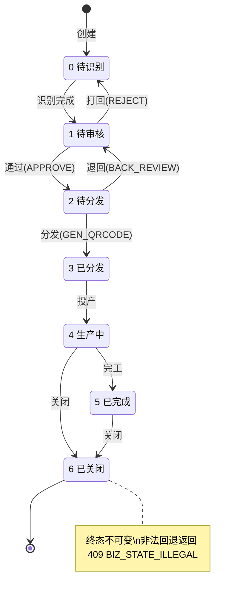

# 03 流程结构文档

> 对应 V5.0 §4.9 状态机、§25.2 接口业务流。实现文件：`backend/app/state_machine.py`（状态机权威源）、`backend/app/store.py`（业务规则）。
>
> 状态机是 `PATCH /status` 校验与 `state-machine` 端点的**唯一数据源**（D3：禁止非法回退、前端按钮由端点驱动禁硬编码）。

## 1. 状态机转移矩阵（§4.9.1 / BR-18）

`STATE_TRANSITIONS`（当前态 → 合法目标态集）：

| 当前态 | 合法跳转 | 说明 |
| --- | --- | --- |
| 0 待识别 | [1] | → 待审核 |
| 1 待审核 | [0, 2] | → 待识别（打回）/ → 待分发（通过） |
| 2 待分发 | [1, 3] | → 待审核（退回）/ → 已分发 |
| 3 已分发 | [4] | → 生产中 |
| 4 生产中 | [5, 6] | → 已完成 / → 已关闭 |
| 5 已完成 | [6] | → 已关闭 |
| 6 已关闭 | [] | 终态不可变（纠错走红冲工单） |

### 1.1 状态图（Mermaid）



### 1.2 校验伪代码（§25.2.4）

```python
def patch_status(order_id, target_state, version):
    wo = get_work_order(order_id)
    if wo is None: return 404 BIZ_ORDER_NOT_FOUND
    if target_state not in STATE_TRANSITIONS[wo.state]:
        return 409 BIZ_STATE_ILLEGAL          # D3 防线
    updated = apply_status_change(order_id, target_state, version)  # 乐观锁 CAS
    if updated is None:
        return 409 BIZ_VERSION_CONFLICT
    return 200 {current_state, version}
```

## 2. 业务流

### 2.1 工单生命周期（主链路）

```
创建(POST /work-orders, state=2)
  → 待分发 GET /state-machine (visible: BACK_REVIEW, GEN_QRCODE)
  → PATCH /status →3 已分发
  → PATCH /status →4 生产中
  → 报工 POST /reports（超报拦截 + 在线合并，BR-05/BR-22）
  → PATCH /status →5 已完成 → PATCH /status →6 已关闭
```

### 2.2 报工流（超报拦截 + 在线合并 + 撤回，§25.2.2 / M5-12 / D4）

```
POST /work-orders/{id}/reports
  1) 校验 order.version == payload.version （乐观锁，否则 409 VERSION_CONFLICT）
  2) 取/建 order_process（演示 required_qty=100）
  3) 超报拦截：completed_qty + 新增 > required_qty → 422 BIZ_REPORT_OVERFLOW（BR-05）
  4) 在线自动合并（BR-22/D4）：completed_qty += 新增；version += 1（服务端累加，不弹二选一）
  5) 写 reports（status=VALID，withdrawable_until = now+30min）
  返回 ReportOut{merged_completed, withdrawable_until}
DELETE /reports/{id}（撤回）
  - 已 WITHDRAWN → 返回 WITHDRAWN
  - 超窗口 → 409 BIZ_WITHDRAW_EXPIRED
  - 否则 status=WITHDRAWN
```

### 2.3 二维码流（3a/3b 拆分，§25.2.6 / BR-21）

```
POST /qrcode/generate        → 3a_GENERATED（print_task_id）
POST /qrcode/batch（≤100）    → 202 + Location（聚合 batchId，M3-02）
POST /qrcode/print/confirm    → 3a → 3b_PRINTED（BR-21）
```

### 2.4 OCR 异步流（§25.2.1 / BR-17）

```
POST /files/upload（multipart）→ 202 + {taskId, status:QUEUED, pollUrl}
GET  /ocr/tasks/{task_id}      → 轮询终态（演示固定 DONE + 字段置信度，BR-20）
```
生产：Worker 独立扩展 + 失败重试 / 死信（§26.7）。

### 2.5 冲突裁决流（§25.2.7 / BR-06 / D7）

```
POST /conflicts/{id}/resolve
  - operator_role != SUPERVISOR → 403 BIZ_PERMISSION_DENY（D7：工人禁裁决）
  - resolve_by ∈ {keep_local, keep_server, merge} → strategy 映射 LOCAL_PENDING/SERVER/MERGED
  - 写 conflict_logs（strategy, resolved_by）
```

### 2.6 大屏 SSE 流（§25.2.8 / BR-19 / D5）

```
GET /bigscreen/metrics?lineId=&max_events=
  - text/event-stream，每 BIGSCREEN_PUSH_INTERVAL_SECONDS=3s 推一帧 metrics（≤5s）
  - 检测 http.disconnect 退出（防资源泄漏）；max_events 上限保证可优雅结束
  - 前端据 server_ts 计算新鲜度，超 30s 标 🟡、超 300s 静态快照降级（D5）
```

### 2.7 工人待办流（§25.3 / V4.1）

```
GET /pending-tasks?operator_id=&state= → 工序级待报工列表（remaining_qty = required - completed）
```

## 3. 乐观锁流程（BR-18）

- `work_orders.version` / `order_process.version` 每次写后 `+1`。
- `PATCH /status` 与 `submit_report` 均要求请求体 `version` 等于服务端当前值，否则 `409 BIZ_VERSION_CONFLICT`。
- `apply_status_change` 用 `orm.version != version → return None` 实现 CAS，避免丢失更新。

## 4. 业务规则（BR）映射

| BR | 含义 | 落地位置 |
| --- | --- | --- |
| BR-05 | 超报拦截 | `store.submit_report` 累计 > 要求量 → 422 |
| BR-06 | 离线冲突合并 | `store.resolve_conflict` + `conflict_logs` |
| BR-15 | 二维码 DPI/尺寸下限 | `QrcodeGenerateRequest` Field(ge=...) |
| BR-16 | 多租户隔离 | `tenant_id` 列（生产拦截器注入） |
| BR-17 | OCR 异步化 | `files.upload` 202 + taskId |
| BR-18 | 状态机校验/禁回退 | `state_machine.py` 唯一源 |
| BR-19 | 大屏新鲜度 | `bigscreen` SSE + server_ts |
| BR-20 | OCR 整单阈值 | `OCR_DOC_CONFIDENCE_THRESHOLD` |
| BR-21 | 打印确认 3a→3b | `confirm_print` |
| BR-22 | 在线自动合并 | `submit_report` 服务端累加 |
| M5-12 | 报工撤回窗口 | `withdraw_report` + `withdrawable_until` |
| D3/D4/D5/D7 | 评审缺陷落实 | 状态机/合并/大屏/裁决权限 |

## 5. 端到端流程时序（创建→报工→关闭）

```
客户端           work_orders         reports            order_process
  │  POST /work-orders ──▶ 建单(state=2) ──▶ 返回 order_uuid/version
  │  GET /state-machine ─▶ 返回 visible_buttons=[BACK_REVIEW,GEN_QRCODE]
  │  PATCH /status→3 ───▶ 校验 allowed + version ──▶ state=3, version+1
  │  PATCH /status→4 ───▶ state=4
  │  POST /reports ─────▶ 校验 version ──▶ 取/建工序 ──▶ 超报?422 : 累加+version+1
  │                      │                │            └─ completed_qty += qty
  │                      │                └─ 写 reports(VALID, 撤回窗口)
  │  PATCH /status→5/6 ─▶ state=5/6
```
